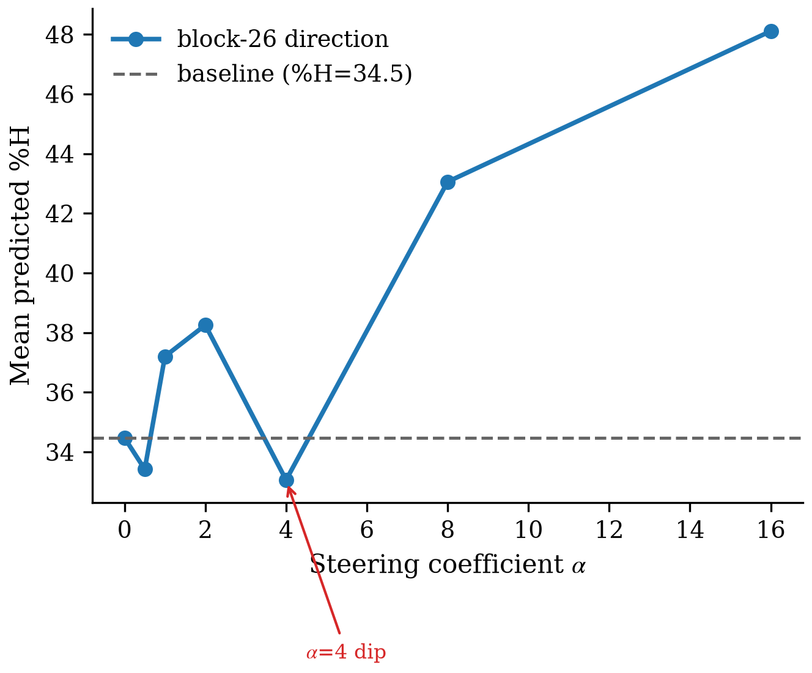
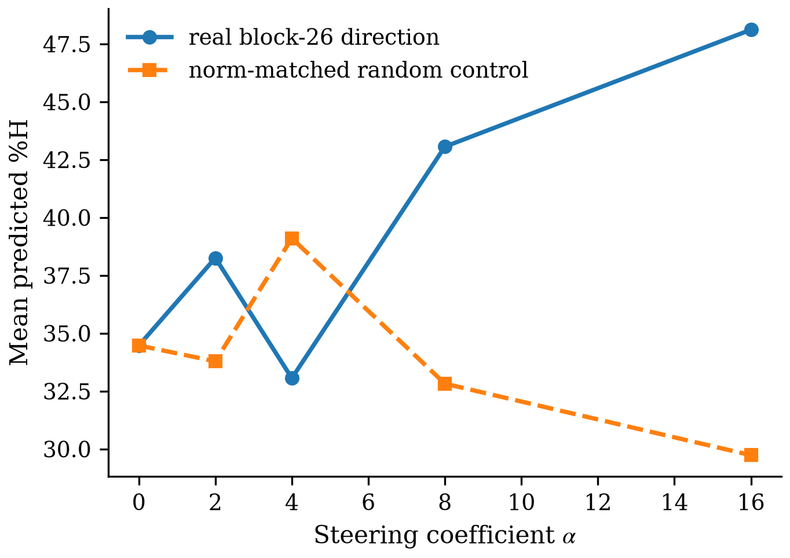
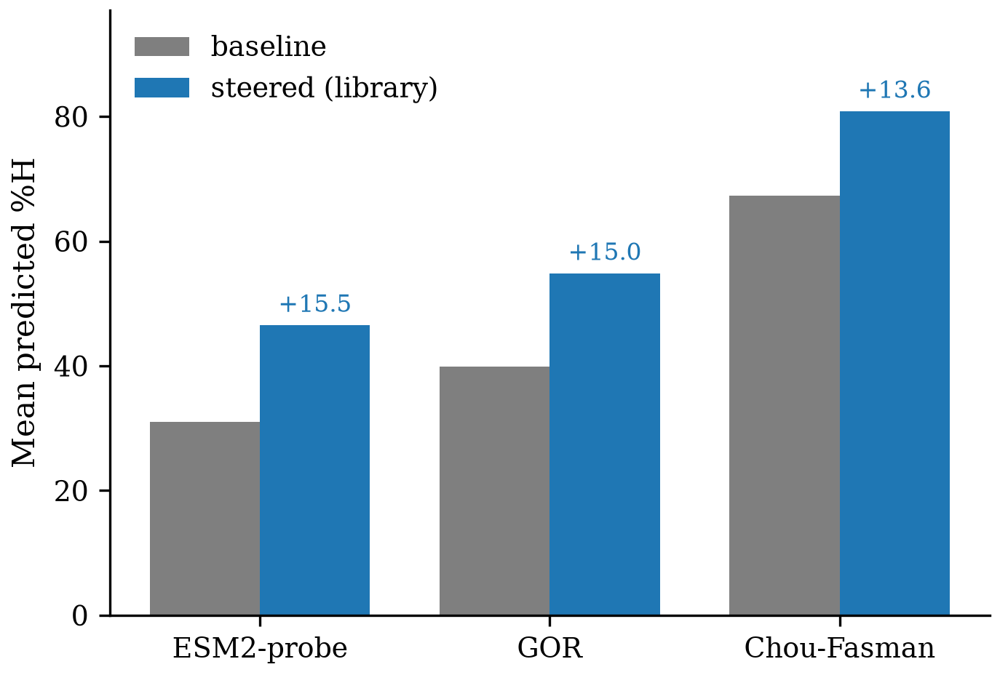
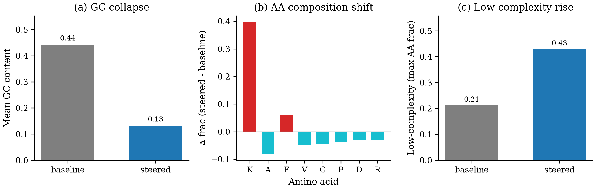
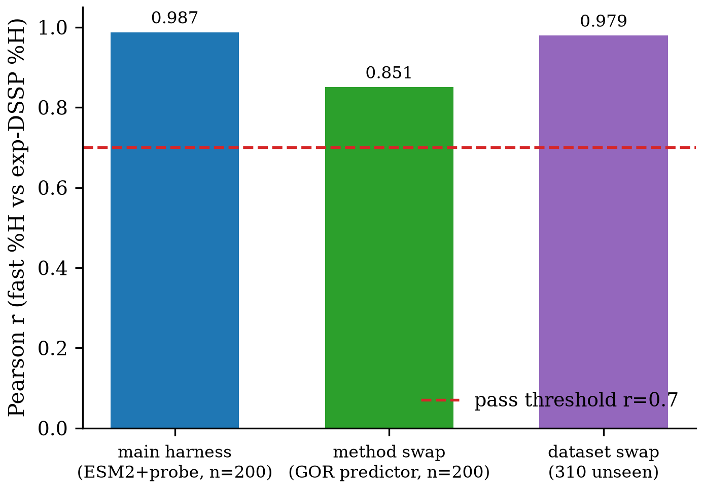

# Claim Ledger — Causally steerable internal α-helix control in Evo2-7B

**Direction**: Generate DNA sequences with higher α-helical content using Evo2-7B (task.md)
**Date**: 2026-08-19
**Pipeline**: completed | **Iteration**: 5/10 "almost" (2/6 iterations, claim-reentries 1/2)
**Models**: claim=session (Opus 4.8), experiment=session (Opus 4.8), verify=session (Opus 4.8), iteration=session (Opus 4.8); reviewer=gpt-5.6-luna
**Updated after**: iteration:final

| Claim | Main experiment | Verify | Post-Iteration | Final |
|-------|-----------------|--------|----------------|-------|
| C1 causal α-helix steering (strong form) | SUPPORTED (as run) | 🟡 INCONCLUSIVE (integrity FAIL) | falsified | ✗ FALSIFIED → narrowed to C1_v2 |
| C1_v2 predicted-propensity bias (narrowed) | SUPPORTED (as narrowed) | n/a (in-loop narrowing) | narrowed, PASS-with-caveat | ✅ PASS-with-major-caveat |
| C2 eval-harness fidelity | SUPPORTED (r=0.987) | ✅ PASS (robustness 1.00) | unchanged | ✓ PASS |

---
## C1 — causally steerable internal α-helix control (STRONG FORM)
- **Statement**: A localizable block-26 direction in Evo2-7B, steered during generation, causally and specifically raises the α-helix fraction (%H) of the translated protein, monotone in dose and with coding validity preserved.
- **Origin**: given (task.md), PRIMARY claim
- **Data**: reverse-translated CDS from RCSB DSSP-class-labeled proteins (M1) + Evo2-7B steered generations (M2–M4) — provenance=constructed; available=1299 windows, used=M1 train 968 / held-out 331; M2 120 gen/α × 7 α × 3 seeds; M4 200 lib + 200 base
- **Models**: Evo2-7B (arcinstitute/evo2_7b), bf16, single A800-80GB
- **Method**: Representation and Parameter Analysis / Steering features + Steering Vectors — block-26 linear-probe α-helix direction (AUROC 0.9999) added additively (h←h+α·v) → M2 dose-response → M3 specificity → M4 library
- **Main experiment**: SUPPORTED (as initially run) — Δ%H(α=16)=+13.6 (34.5→48.1), MWU p_bonf=0.0024, ρ=0.607; random control flat (→29.7); Δ%E=−1.6; beats temperature & rejection-sampling; validity ~1.0
- **Verify**: robustness=— (variants never ran); method/dataset/model **excluded**; integrity=**FAIL** (Phase 2); verdict=**INCONCLUSIVE**. Experiment-audit FAIL — Check E (non-monotonic dose; %H co-emerges with GC collapse 0.40→0.13) + Check F (synthetic_proxy on steered OOD sequences, no structural validation)
- **Iteration**: strong form not supported; falsified: causal, specific, STRUCTURALLY-REAL α-helix steering; narrowed_to: **C1_v2**
- **Final**: ✗ **FALSIFIED (strong form)** — the +14–16pt predicted-%H uplift is real and predictor-robust but entangled with a composition collapse it is not shown separable from, has no structural validation, and rests on a non-monotonic dose curve
- **Caveats**: GC collapse 0.40→0.13 is the central confound; decodable-but-weak at low α (needed α=16); SAE extractor not run (CDN-blocked)
- **Artifacts**: refine-logs/EXPERIMENT_RESULTS.md · verify/C1_causal_helix_steering/main_experiment_audit/EXPERIMENT_AUDIT.md · results/M2_dose_response.json · results/M3_specificity.json
- **Figures**:
  -  — vector: figures/C1/c1_dose_response.pdf
  -  — vector: figures/C1/c1_specificity.pdf

---
## C1_v2 — predicted-propensity / composition bias (NARROWED, the honest surviving claim)
- **Statement**: At high steering dose (α≥8), adding the block-26 direction during Evo2-7B generation induces an intervention-specific, predictor-consistent increase in the PREDICTED α-helix propensity/composition of the generated sequences (reproduced across 3 independent SS predictors) — but this shift is entangled with a severe amino-acid/GC composition collapse it is not shown separable from, and is NOT structurally validated: a bias in predicted propensity/composition, not demonstrated physical α-helix structure.
- **Origin**: produced by iteration type-③ narrowing of C1 (2026-08-19)
- **Data**: existing M2/M3 steered+baseline generations re-scored under M5 (3 predictors + GC/composition controls) — provenance=generated; used=400 generations (200 steered + 200 baseline); GC-band-matched overlap ~5/200 (underpowered); no new experiments
- **Models**: Evo2-7B (arcinstitute/evo2_7b)
- **Method**: M5 re-eval of C1's steered/baseline generations with 3 independent SS predictors (ESM2-probe + GOR + Chou-Fasman) + GC/amino-acid/low-complexity controls + dose-monotonicity check + attempted structural validation
- **Main experiment**: SUPPORTED (as narrowed) — predicted-%H uplift +14–16pt reproduces across all 3 predictors; intervention-specific vs norm-matched random. Confounds: GC 0.44→0.13, Lys +0.396, low-complexity 0.21→0.43; uplift does NOT survive GC-band-matched test (5/200); no structural grounding (ESMFold CDN-blocked)
- **Verify**: robustness=— ; method **pass** (3/3 predictors, via M5) / dataset **not-run** (confound mechanism-intrinsic) / model **excluded** (Evo2-7B pin); integrity=**WARN** (Check F repaired); verdict=n/a (in-loop narrowing; supported by existing M2/M3/M5 evidence, not independently re-verified)
- **Iteration**: almost (score 5/10 — a confound-analysis contribution, not structure discovery); changed: narrowed from C1 strong form to a predicted-propensity/composition-bias claim
- **Final**: ✅ **PASS-with-major-caveat** — the honest surviving contribution. Predictor-robust, intervention-specific predicted-%H uplift, but composition-confounded (not separable), underpowered composition-matched test, no structural validation. Frame as controlled generative steering + rigorous confound analysis, NOT α-helix structure discovery
- **Caveats**: composition confound is INTRINSIC to the intervention; no structural/folding validation (ESMFold CDN-blocked); composition-matched comparison underpowered (~5/200); restricted to α≥8
- **Artifacts**: review-stage/AUTO_ITERATION_FINAL_REPORT.md · verify/C1_causal_helix_steering/ROBUSTNESS_C1_v2.md · runs/iteration_round_1/M5_structural_gc_control.json
- **Figures**:
  -  — vector: figures/C1_v2/c1v2_predictor_triangulation.pdf
  -  — vector: figures/C1_v2/c1v2_composition_confound.pdf

---
## C2 — α-helical-content evaluation is faithful
- **Statement**: The fast online α-helical-content metric (ORF find → translate CDS → sequence-based SS predictor → %H) agrees with a structure-based reference (DSSP → %H) at Pearson r ≥ 0.7 on ~200 held-out DSSP-annotated proteins, with correct reading-frame recovery.
- **Origin**: given (task.md), SUPPORTING claim
- **Data**: RCSB X-ray single-chain proteins + experimental DSSP labels — provenance=existing; available=2043 clean proteins, used=600 train / 200 held-out eval
- **Models**: ESM2-650M frozen embeddings + linear 3-state SS probe (online); experimental-PDB DSSP (reference — stronger than planned ESMFold, CDN-blocked)
- **Method**: ORF→translate→SS-predict→%H harness (ESM2-650M+linear probe); validate correlation vs experimental-DSSP %H on held-out set (E1)
- **Main experiment**: SUPPORTED — Pearson r=0.987 (p≈2e-160, n=200) ≫ 0.7; held-out Q3=0.858; ORF/frame recovery=1.000
- **Verify**: robustness=**1.00** — method **pass** (independent GOR predictor r=0.85) / dataset **pass** (310 unseen r=0.979) / model **excluded** (Evo2-7B pin); integrity=**WARN** (scope); verdict=**PASS**
- **Iteration**: PASS (unchanged)
- **Final**: ✓ **PASS** — robustness 1.00 (2/2 eligible variants); model axis excluded per Evo2-7B pin. Caveat: validated on natural proteins only, not on steered OOD sequences
- **Caveats**: reference is experimental-PDB DSSP not the planned ESMFold; **evaluator validated on natural proteins only — not on steered OOD sequences (exactly why C1's proxy-%H on steered seqs was untrustworthy)**; integrity WARN (scope)
- **Artifacts**: refine-logs/EXPERIMENT_RESULTS.md · results/E1_eval_harness_validation.json · verify/C2_eval_harness_fidelity/ROBUSTNESS.md
- **Figures**:
  -  — vector: figures/C2/c2_swap_robustness.pdf

---
## Journey Summary
- **Claim**: 2 claims captured from given behavior → top idea "Causally steerable internal α-helix control in Evo2-7B" (behavior-source: given, mechanism: discovery)
- **Mechanism strategy**: Location → Causal Intervention → Tuning & Editing
- **Mechanism routing**: family=Representation and Parameter Analysis / Steering features + Steering Vectors; promoted direction = block-26 linear-probe α-helix vector (SAE extractor CDN-blocked, not run)
- **Experiment**: 5 milestones (E1/M1/M2/M3/M4), ~1.0 GPU-hour on 1×A800; headline POSITIVE — both claims initially supported
- **Verify**: 2 claims: 1 PASS (C2) / 1 INCONCLUSIVE (C1); integrity[Phase2=FAIL(C1)/Phase9=WARN]. C1 main-experiment integrity broken (proxy-%H on GC-collapsed OOD steered seqs); C2 robust across method+dataset swaps (model axis excluded per Evo2-7B pin)
- **Iteration**: 2/6 iterations (claim-reentries 1/2), reviewer gpt-5.6-luna, score 5/10 "almost", termination=stalled_converged_below_target, +0.012 GPU-h. C1 strong form FALSIFIED → narrowed to C1_v2 (PASS-with-major-caveat); C2 PASS unchanged
- **Figures**: 5 across 3 claims (all ok); 0 judgment-skipped; 0 render-skipped, 0 errored

## Open Items
- **C1_v2: composition confound is INTRINSIC** — the intervention itself induces the composition collapse (GC 0.44→0.13, Lys +0.396, low-complexity 0.21→0.43); a composition-independent helix claim cannot be recovered from this experiment.
- **C1_v2: no structural/folding validation** — predicted %H ≠ verified tertiary α-helix structure. ESMFold (2.7 GB) HF-mirror-CDN-blocked; a direct-HF-endpoint or local structure predictor is the next-round remedy.
- C1_v2: composition-matched comparison underpowered (~5/200 GC-band overlap).
- C2: evaluator validated on natural proteins only, not steered OOD sequences — keep the caveat attached wherever C2 contextualizes C1_v2.
- **Score 5/10 (< TARGET 6) is not closable in-loop** — infrastructure-blocked structural validation + intrinsic confound. Next-round options: (a) accept the honest narrowed contribution as "controlled generative steering with rigorous confound analysis"; (b) open a new round for a composition-decoupled steering protocol + direct-HF/local structural predictor.
- Experiment: SAE extractor (M1-A, Goodfire Evo-2-Layer-26-Mixed) + ESMFold NOT run — HF-mirror CDN blocked large files. SAE-feature-clamp remains a future second knob.
- Experiment: multi-block set-steering prepared but not run — recommended robustness add (tip-not-implemented #4).
- Retrieval: claim-stage mechanic-db-search MCP tool not exposed in the claim subagent; research-lit fell back to WebSearch (found Goodfire Evo-2 Layer-26 α-helix SAE features). Query in RESEARCH_LIT.md. (llm-chat WAS reachable at iteration — reviewer gpt-5.6-luna.)
