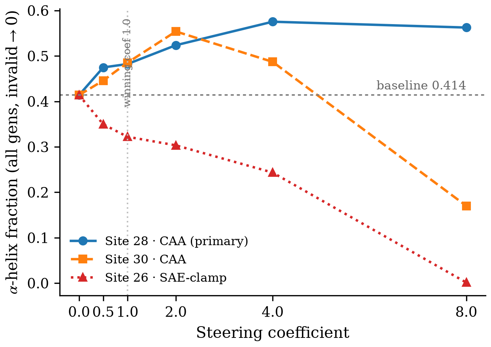
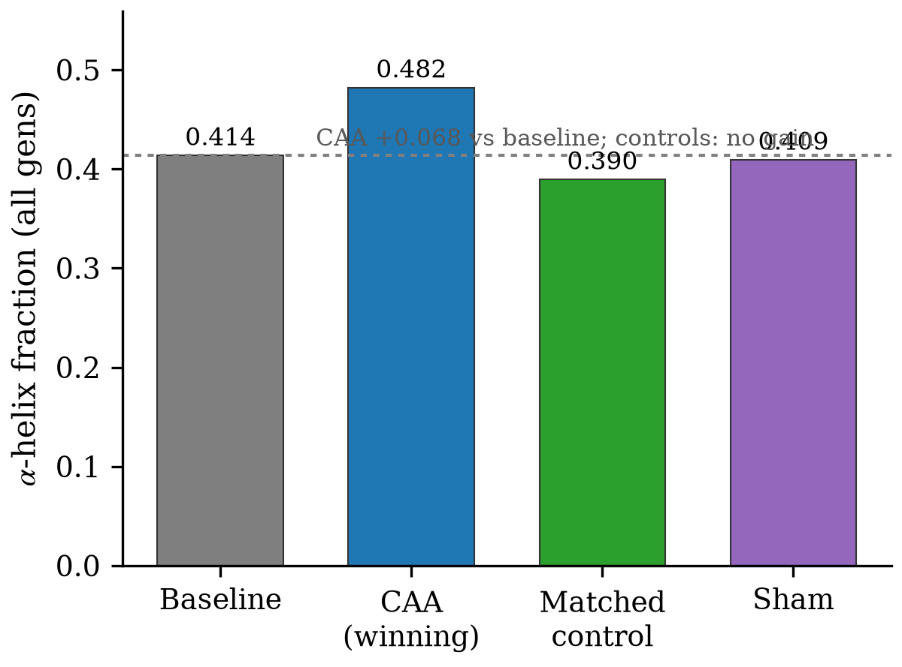
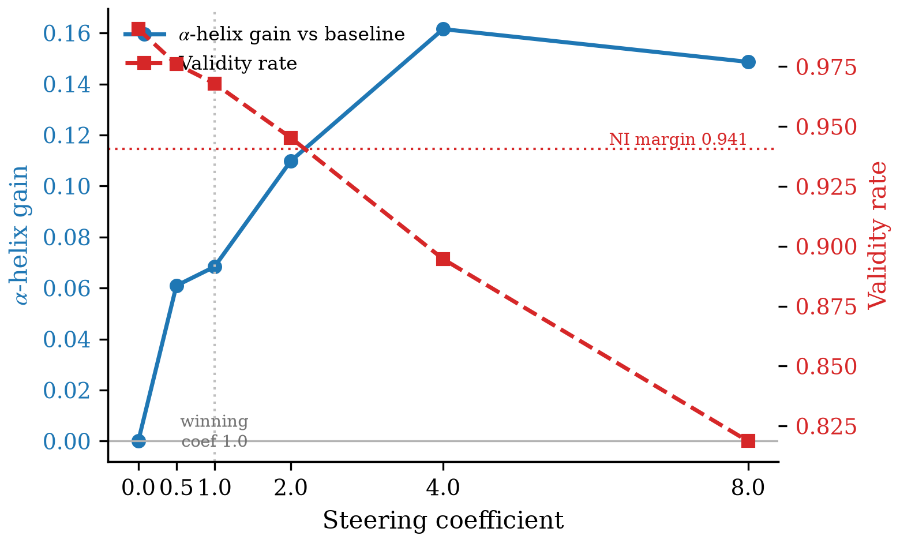

# Figures Index — Constrained property-steering of Evo2-7B toward high α-helical content

Generated by the `/auto` Ledger Figures hook (`/paper-figure` auto-ledger mode), 2026-08-24. 3 figures across 2 claims; 0 skipped, 0 errored.

## C1 — intervention raises α-helix fraction (dose-response, direction-specific)

 — vector: `C1/c1_dose_response.pdf`

 — vector: `C1/c1_specificity.pdf`

## C2 — intervention preserves validity (dose–validity tradeoff)

 — vector: `C2/c2_validity_frontier.pdf`
