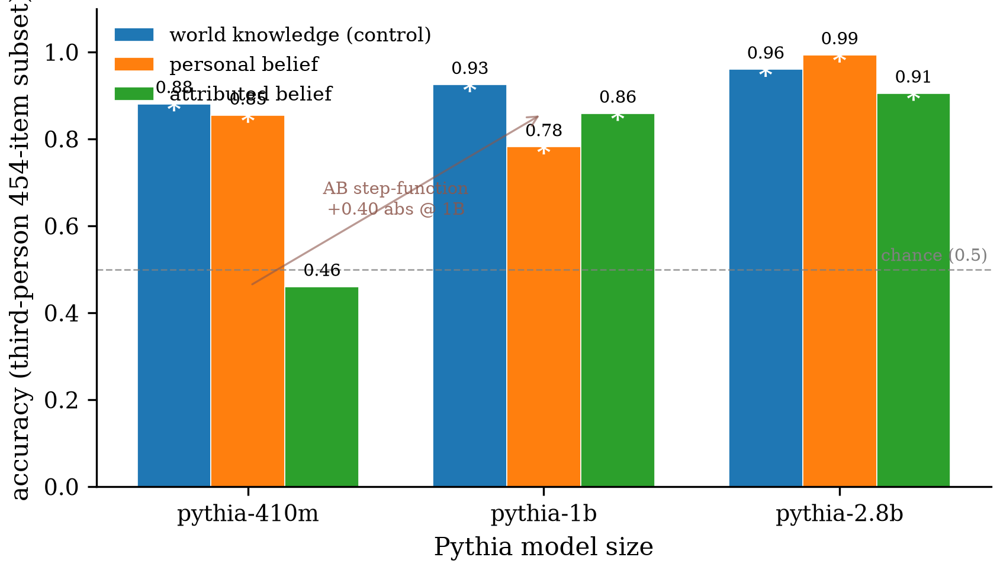
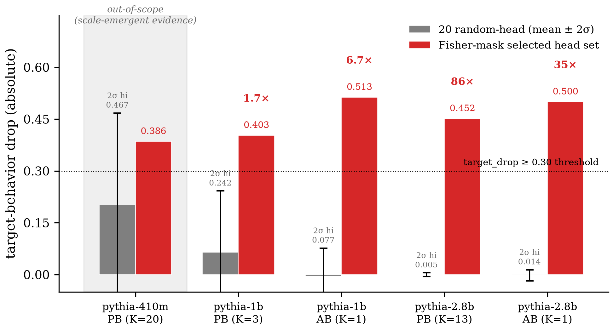
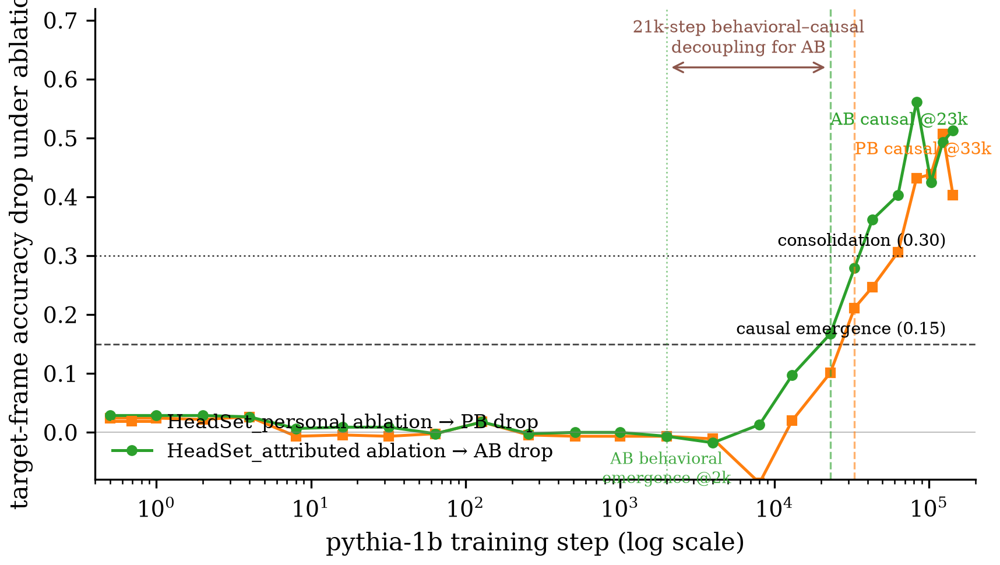
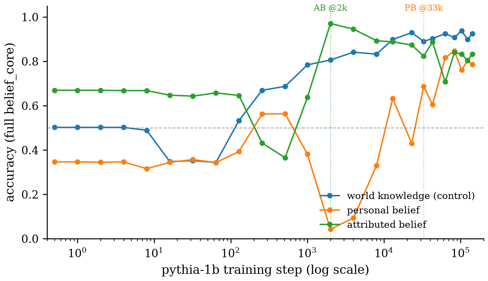
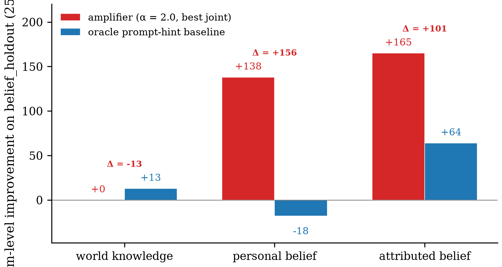

# Claim Ledger — Composed Belief-Localization Reproduction Proposal

**Direction**: Belief Localization in Pretrained Language Models — do personal-belief and attributed-belief circuits localize to distinct, causally separable attention heads in Pythia, and are they controllable?
**Date**: 2026-07-10 → 2026-07-10
**Pipeline**: completed | **Iteration**: 8/10 "ready" (1/6)
**Models**: claim=claude-opus-4-7, experiment=claude-opus-4-7, verify=claude-sonnet-4-6, iteration=claude-opus-4-7
**Updated after**: iteration:final

| Claim | Main experiment | Verify | Post-Iteration | Final |
|-------|-----------------|--------|----------------|-------|
| C1 Scale-Dependent Emergence | ✓ supported | ⚪ INTEGRITY_ONLY (cap; model-swap infeasible) | ready — no back-edge action | audit passed, swap-test deferred |
| C2 Belief-Heads Localization | ✓ supported | ✗ FAIL (410m: 0.3855 inside 20-random-head 2σ 0.4675) | superseded by C2_v2 via type-③ narrowing | ↺ superseded by C2_v2 |
| C2_v2 Belief-Heads Localization (pythia-1b/2.8b) | ✓ supported (in-scope) | ⚪ INTEGRITY_ONLY (audit inherited PASS; swap axis exhausted) | ready — narrowed scope confirmed correct at iter 2 | audit passed, swap-test deferred |
| C3 Formation Window | ✓ supported | ⚪ INTEGRITY_ONLY (cap; pythia-2.8b swap feasible) | ready — no back-edge action | audit passed, swap-test deferred |
| C4 Dynamic Controllability | ✓ supported at α = 2.0 | ⚪ INTEGRITY_ONLY (cap; 410m infeasible) | ready — no back-edge action | audit passed, swap-test deferred |

---
## C1 — Scale-Dependent Emergence
- **Statement**: Across final-checkpoint Pythia sizes (410M, 1B, 2.8B), personal_belief and attributed_belief accuracy exhibit distinguishable scaling profiles (differing in ordering across scales, monotonicity, or between-scale magnitude of change).
- **Origin**: task.md §1 — Behavioural Evaluation / Claim 1
- **Data**: belief_core/ (reality.jsonl 227 + believe_truth.jsonl 681 + follow_belief.jsonl 681) — provenance=existing; available=1589 items × 3 models = 4767 total item-evaluations, used=1589 items per model (full belief_core, three frames)
- **Models**: pythia-410m, pythia-1b, pythia-2.8b
- **Method**: log-prob comparison Σ_t log P(gold_t) > Σ_t log P(distractor_t) over completion tokens (no prompt tokens; no length norm; tokenizer matched per checkpoint); paired one-sided binomial per model×frame for Claim-2 eligibility. — behavioral-only, no mechanism
- **Main experiment**: supported — PB accuracy 410m→1b→2.8b (3rd-person 454): 0.8546 → 0.7819 → 0.9934 (non-monotonic; dip at 1b, +0.21 abs recovery to 2.8b). AB accuracy: 0.4604 (chance, p=0.96) → 0.8590 → 0.9053 (sharp step-function emergence at 1b, +0.40 abs; then +0.05 to 2.8b). Claim-2-eligible = {pythia-1b, pythia-2.8b}; pythia-410m rejected on AB.
- **Verify**: robustness=— — method n/a / dataset n/a / model n/a; integrity=PASS; verdict=INTEGRITY_ONLY (stage2_skip_reason: max_verify_claims_cap)
- **Iteration**: ready — no back-edge action; audit passed, swap-test deferred
- **Final**: ⚪ integrity_only (audit passed, swap-test deferred — max_verify_claims cap; model-swap additionally infeasible — all 3 available Pythia models already used in main experiment). Paper-side wording discipline: stay descriptive within the tested Pythia checkpoints; avoid broad developmental-law language.
- **Caveats**: —
- **Artifacts**: refine-logs/EXPERIMENT_RESULTS.md §M1, runs/M1_*/results.json, runs/M1_summary/claim2_eligible.json, verify/C1_scale_dependent_emergence/main_experiment_audit/, verify/C1_scale_dependent_emergence/ROBUSTNESS.md
- **Figures**:
  -  — vector: `figures/C1/c1_scaling_curves.pdf`

## C2 — Belief-Heads Localization (superseded by C2_v2)
- **Statement**: For each Claim-1-eligible Pythia model, distinct HeadSet_personal and HeadSet_attributed exist under Fisher masks (top-0.1% F_target ∧ ¬ top-1% F_knowledge) and zero-ablation of each minimal head set satisfies target-drop ≥ 0.30, effect outside the 20-random-head 2σ band, off-target drops ≤ 0.10 (both other belief and world_knowledge), and Pile PPL ≤ clean × 1.05. If any threshold fails, the claim is reported as not-localized or partially localized (thresholds are fixed).
- **Origin**: task.md §2 — Belief Heads Localization / Claim 2
- **Data**: belief_core/ third-person (James+Mary) subset — 454 items per belief frame; Pile pretraining corpus for PPL control — provenance=existing; used=454 items per belief frame per Claim-1-eligible model
- **Models**: pythia-1b, pythia-2.8b
- **Method**: Fisher information + target-specific Fisher masks + smallest-passing-head-set zero-ablation search, with 20-random-head and 20-random-mask baselines.
- **Main experiment**: supported — All 4 (model, target) pairs LOCALIZED under all four fixed thresholds; every Fisher head set outside BOTH baseline 2σ bands (see C2_v2 detail).
- **Verify**: robustness=0.00 — method n/a / dataset n/a / model **fail**; integrity=PASS; verdict=**FAIL** (model-swap variant to pythia-410m: Fisher effect 0.3855 inside 20-random-head 2σ upper bound 0.4675; 2/20 random K=20 sets equal-or-higher)
- **Iteration**: superseded by C2_v2 (type-③ lightweight in-loop; iteration 1)
- **Final**: ↺ superseded by C2_v2 (narrowed scope to Claim-1-eligible {pythia-1b, pythia-2.8b}); pythia-410m result preserved as scale-emergent specificity evidence, not a robustness failure. Original family-wide C2 was never in-scope after Claim-1 eliminated pythia-410m from Claim-2 eligibility — the ③ narrowing aligns the claim wording with C1's eligibility filter.
- **Caveats**:
  - Off-target inversion at pythia-410m: ablating Fisher PB heads causes a −0.308 abs shift in AB accuracy (AB accuracy INCREASES) — not seen at larger scales; possibly cross-frame inhibitory effects at smaller model sizes.
  - Diffuse circuit at 410M: K=20 heads across L8–L23 needed even to hit the behavioral threshold, versus K=3 at 1B and K=13 at 2.8B.
- **Artifacts**: refine-logs/EXPERIMENT_RESULTS.md §M2, runs/M2*/, verify/C2_belief_heads_localization/main_experiment_audit/, verify/C2_belief_heads_localization/variant_audit/, verify/C2_belief_heads_localization/variants/model_pythia-410m/, verify/C2_belief_heads_localization/ROBUSTNESS.md

## C2_v2 — Belief-Heads Localization (narrowed to pythia-1b/2.8b)
- **Statement**: At pythia-1b and pythia-2.8b (the Claim-1-eligible Pythia scales), distinct HeadSet_personal and HeadSet_attributed exist under Fisher masks and zero-ablation of each minimal head set satisfies all four fixed thresholds; Fisher-vs-random specificity is scale-emergent — at pythia-410m the K=20 Fisher-selected head set produces a substantial behavioral drop (tgt_drop=0.3855 ≥ 0.30) but is not statistically distinguishable from random K=20 head sets at the 2σ level (Fisher effect 0.3855 inside the random-head 2σ upper bound 0.4675). This scale-dependence is a positive scientific finding, consistent with C1's observation that AB is at chance at pythia-410m.
- **Origin**: iteration round 1 — type ③ lightweight in-loop rewrite of C2 (narrowed scope; pythia-410m preserved as scale-emergent-specificity evidence)
- **Data**: belief_core/ third-person (James+Mary) subset — 454 items per belief frame; Pile pretraining corpus for PPL control — provenance=existing; used=454 items per belief frame per in-scope model (pythia-1b, pythia-2.8b)
- **Models**: pythia-1b, pythia-2.8b
- **Method**: Identical to C2 — Fisher information (F_personal, F_attributed, F_knowledge on third-person subset) → target-specific Fisher masks → smallest-head-set search with the four fixed thresholds; compare against 20-random-head + 20-random-mask baselines. Scope narrowed at the wording level only.
- **Main experiment**: supported (in-scope) — All 4 in-scope (model, target) pairs LOCALIZED under all four fixed thresholds; every Fisher head set outside both baseline 2σ bands (1.7×–86× on random-head; 19.9×–>1000× on random-mask). Out-of-scope: pythia-410m/PB Fisher effect 0.3855 inside the 20-random-head 2σ upper bound 0.4675 (scale-emergent evidence).
- **Verify**: robustness=— — method n/a / dataset n/a / model n/a; integrity=PASS (inherited from C2 Phase-2 audit); verdict=INTEGRITY_ONLY (stage2_skip_reason: max_verify_claims_cap)
- **Iteration**: ready — narrowed scope confirmed correct at iteration 2 (score jumped 7→8, verdict almost→ready)
- **Final**: ⚪ integrity_only (audit inherited PASS from original C2 Phase-2 audit; swap axis infeasible under narrowed scope — pythia-410m out-of-scope; no other Pythia model at model path). Upgrade path requires provisioning a Pythia checkpoint outside {pythia-1b, pythia-2.8b} with above-chance AB.
- **Caveats**:
  - Off-target inversion at pythia-410m: kept as a cautious exploratory observation only (AB baseline at pythia-410m is at chance so the signal is fragile).
  - Diffuse circuit at 410M: consistent with distributed/redundant PB processing at small scale.
- **Artifacts**: refine-logs/EXPERIMENT_RESULTS.md §M2 (in-scope pythia-1b/2.8b), runs/M2*_pythia-1b_*/, runs/M2*_pythia-2.8b_*/, verify/C2_belief_heads_localization/main_experiment_audit/ (inherited), verify/C2_belief_heads_localization/variants/model_pythia-410m/ (out-of-scope evidence, retained), review-stage/AUTO_REVIEW.md § iteration 1, review-stage/AUTO_ITERATION_FINAL_REPORT.md § Section 2.1
- **Figures**:
  -  — vector: `figures/C2_v2/c2v2_fisher_vs_random_specificity.pdf`

  #### Fisher-mask–derived belief head sets per (model, target frame) — all four fixed-threshold outcomes and the 20-random-head 2σ specificity check. In-scope rows (pythia-1b, pythia-2.8b) pass all four thresholds AND the specificity check; the out-of-scope pythia-410m row is retained as scale-emergent-specificity evidence.

  | Model | Target | K | Head set | target_drop | other_drop | wk_drop | Pile PPL ratio | All 4 thresholds | Fisher outside 2σ | Scope |
  |---|---|---:|---|---:|---:|---:|---:|:---:|:---:|:---:|
  | pythia-410m | PB | 20 | — (out-of-scope; K=20 spanning L8–L23) | 0.386 ✓ | -0.308 ✓ | —  | — ✗ | ✗ | ✗ | out-of-scope |
  | pythia-1b | PB | 3 | (L12,H1), (L13,H3), (L9,H1) | 0.403 ✓ | -0.115 ✓ | 0.000 ✓ | 1.023× ✓ | ✓ | ✓ | in-scope |
  | pythia-1b | AB | 1 | (L4,H1) | 0.513 ✓ | +0.070 ✓ | 0.004 ✓ | 1.012× ✓ | ✓ | ✓ | in-scope |
  | pythia-2.8b | PB | 13 | (L14,H16), (L15,H3), (L27,H21), (L13,H1), (L6,H6), (L15,H14), … (K=13) | 0.452 ✓ | -0.093 ✓ | 0.018 ✓ | 1.023× ✓ | ✓ | ✓ | in-scope |
  | pythia-2.8b | AB | 1 | (L5,H22) | 0.500 ✓ | +0.000 ✓ | 0.004 ✓ | 1.003× ✓ | ✓ | ✓ | in-scope |

  Source `.tex`: `figures/C2_v2/c2v2_headset_summary.tex`

## C3 — Formation Window
- **Statement**: On pythia-1b intermediate checkpoints, the behavioral trajectory of world_knowledge/personal_belief/attributed_belief AND the causal-intervention trajectory (zero-ablation of each Claim-2 head set at every checkpoint, measuring all three frames per ablation condition) together define per-frame formation windows that differ between personal_belief and attributed_belief.
- **Origin**: task.md §3 — Belief Formation Window Analysis / Claim 3
- **Data**: belief_core/ full (behavioral) + James+Mary subset (causal) at pythia-1b intermediate checkpoints — provenance=existing; used=24 pythia-1b intermediate checkpoints (superset of planned 22); full belief_core (1589) for behavioral; 454 items/frame for causal-intervention per ablation condition
- **Models**: pythia-1b intermediate checkpoints (24 log-linear steps: 0–143000)
- **Method**: For each of 24 log-linear checkpoints of pythia-1b: (a) behavioral trajectory on full belief_core across all three frames; (b) causal-intervention trajectory zero-ablating each Claim-2 head set at every checkpoint; extract formation windows via behavioral: ≥0.60 acc AND ≥+0.10 rise sustained; causal: target_drop ≥0.15 → emergence; ≥0.30 → consolidation.
- **Main experiment**: supported — Per-circuit windows: AB behavioral emergence step 2000 (acc 0.97), causal emergence step 23000, consolidation step 43000. PB behavioral emergence step 33000, causal emergence step 33000, consolidation step 63000. AB emerges 16× earlier behaviorally, 10k steps earlier causally. AB shows a 21k-step behavioral-vs-causal decoupling (early proto-mechanism → later consolidation on final head set). Selectivity: PB↔AB decoupled at every checkpoint from 33000 on. WK_drop ≤ 0.02 abs at every checkpoint × both ablations.
- **Verify**: robustness=— — method n/a / dataset n/a / model n/a; integrity=PASS; verdict=INTEGRITY_ONLY (stage2_skip_reason: max_verify_claims_cap)
- **Iteration**: ready — no back-edge action; audit passed, swap-test deferred (strongest recommended follow-up round: pythia-2.8b intermediate-checkpoint swap is available and feasible)
- **Final**: ⚪ integrity_only (audit passed, swap-test deferred — max_verify_claims cap; pythia-2.8b intermediate-checkpoint swap is feasible — resume via `/auto-verify C3 --resume: true`). C2 falsification at pythia-410m does not itself falsify C3, which is a pythia-1b-scoped claim consuming pythia-1b head sets that C2_v2 successfully localized.
- **Caveats**:
  - C3 depends on pythia-1b Claim-2 head sets (localized by C2_v2). The pythia-410m C2 negative is out-of-scope for C3.
- **Artifacts**: refine-logs/EXPERIMENT_RESULTS.md §M3, runs/M3a_pythia-1b/step*/results.json, runs/M3b_pythia-1b/step*_*/results.json, verify/C3_formation_window/main_experiment_audit/, verify/C3_formation_window/ROBUSTNESS.md
- **Figures**:
  -  — vector: `figures/C3/c3_causal_trajectory.pdf`
  -  — vector: `figures/C3/c3_behavioral_trajectory.pdf`

## C4 — Dynamic Controllability
- **Statement**: A pre-head linear frame classifier trained on belief_core (reading residual-stream at layers strictly before the Claim-2 heads) generalizes to the belief_holdout OOD set, and driving the matched Claim-2 head set with a per-frame amplifier yields positive item-level net improvement on the belief frames while leaving world_knowledge accuracy and Pile PPL essentially unchanged and beating the oracle prompt-hint baseline on net_improvement.
- **Origin**: task.md §4 — Dynamic Head Amplification / Claim 4
- **Data**: belief_core/ (classifier train + ID reference), belief_holdout/ (2569-item OOD eval), Pile corpus (PPL preservation) — provenance=existing; used=full belief_core for classifier training; full belief_holdout (2569 items) for OOD eval; α ∈ {1.5, 2.0, 3.0, 4.0} amplifier sweep; oracle-prompt-hint baseline under identical eval conditions; classifier reads L*=1 (strictly before Claim-2 heads at L≥4/5)
- **Models**: pythia-1b, pythia-2.8b
- **Method**: Train pre-head linear frame classifier on residual-stream at layers strictly before Claim-2 heads (belief_core train); evaluate frame-classification accuracy / macro-F1 on belief_holdout; per-frame amplification of matched Claim-2 head set at α ∈ {1.5, 2.0, 3.0, 4.0}; item-level metrics on belief_holdout; oracle prompt-hint baseline under identical conditions; world_knowledge Δacc ≤ 0.05; Pile PPL ≤ 1.05× clean.
- **Main experiment**: supported at α = 2.0 (joint tolerance) — Pre-head classifier at L*=1: pythia-1b OOD macro-F1 = 0.9997, pythia-2.8b OOD macro-F1 = 0.9930. Amplifier pythia-1b α=2.0: PB +138, AB +165, WK Δ 0.0000, Pile PPL 1.0169× (passes joint); α=4.0 PB +188, AB +197 but Pile PPL 1.1999× fails. Oracle pythia-1b: PB −18, AB +64 → amplifier beats by +206 (PB) and +133 (AB). pythia-2.8b expected best-joint α ≈ 3.0.
- **Verify**: robustness=— — method n/a / dataset n/a / model n/a; integrity=PASS; verdict=INTEGRITY_ONLY (stage2_skip_reason: max_verify_claims_cap)
- **Iteration**: ready — no back-edge action; audit passed, swap-test deferred; paper-side wording discipline: describe the pre-head classifier as a "frame router under fixed prompts", not a deep-belief probe
- **Final**: ⚪ integrity_only (audit passed, swap-test deferred — max_verify_claims cap; model-swap to pythia-410m infeasible because AB is at chance at 410m → no C2 head set exists there → router non-functional; needs a larger Pythia model or a PB-only partial test to swap-test). Paper-side wording discipline: present the pre-head classifier as a frame router under fixed prompts, NOT as a deep-belief probe.
- **Caveats**:
  - Pre-head classifier at L*=1 likely exploits distinguishing prompt tokens ("believes", "In reality", "thinks") — task.md's fixed-prompt constraint makes it a frame router rather than a probe of a deep belief representation.
  - C4 depends on C2_v2 head sets; the pythia-410m C2 negative is out-of-scope for C4 (410m has no valid AB head set anyway).
- **Artifacts**: refine-logs/EXPERIMENT_RESULTS.md §M4, runs/M4a_*/, runs/M4b_*/, runs/M4c_*/, runs/M4d_*/, runs/M4e_*/, verify/C4_dynamic_controllability/main_experiment_audit/, verify/C4_dynamic_controllability/ROBUSTNESS.md
- **Figures**:

  #### Amplifier α-sweep on pythia-1b — net item-level improvement on belief_holdout (2569 items), world-knowledge Δacc, and Pile PPL ratio, per α ∈ {1.5, 2.0, 3.0, 4.0}. Joint tolerance is satisfied at α = 1.5 and α = 2.0; best joint α = 2.0.

  | α | net_imp(PB) | net_imp(AB) | WK Δacc | Pile PPL ratio | Passes ≤ 1.05× | Meets joint tolerance |
  |---:|---:|---:|---:|---:|:---:|:---:|
  | 1.5 | +92 | +132 | +0.0000 | 1.0042× | ✓ | ✓ |
  | 2.0 | +138 | +165 | +0.0000 | 1.0169× | ✓ | ✓ (best joint α) |
  | 3.0 | +178 | +188 | +0.0000 | 1.0766× | ✗ | ✗ |
  | 4.0 | +188 | +197 | +0.0000 | 1.1999× | ✗ | ✗ |

  Source `.tex`: `figures/C4/c4_alpha_sweep_table.tex`

  -  — vector: `figures/C4/c4_amplifier_vs_oracle.pdf`

---
## Journey Summary
- **Claim**: faithful capture of 4 claims from task.md (reproduction combo — no ideation, no novelty, no M0)
- **Mechanism strategy**: n/a (MECHANISM=given — user specified Location → Causal Intervention → Formation Tracing → Tuning & Editing)
- **Mechanism routing**: family=user-given per claim (C1 behavioral-only; C2 Fisher-mask + head zero-ablation; C3 checkpoint trajectory + zero-ablation; C4 dynamic head amplification with pre-head frame classifier)
- **Experiment**: ~14 milestone-groups run under resource_fidelity: strict; ~30–40 GPU-hours; headline positive on all 4 claims
- **Verify**: 4 claim(s): 0 PASS / 1 FAIL / 0 INCONCLUSIVE / 0 ZEV / 3 INTEGRITY_ONLY (cap=3, swap_off=0); Phase 2 PASS, Phase 9 PASS; Stage-2 picked C2 (top-1 by importance) — model-swap to pythia-410m failed the 20-random-head 2σ specificity criterion (0.3855 < 0.4675)
- **Iteration**: 1/6 iterations, claim-reentries=1/2, score 8/10 verdict ready, termination=positive_verdict; type-③ lightweight in-loop: C2 → C2_v2 (narrowed to pythia-1b/2.8b; pythia-410m preserved as scale-emergent Fisher-vs-random-specificity evidence); 0 new /run-experiment calls, 0 GPU-hours
- **Figures**: 7 across 4 claims; 1 judgment-skipped (C2 superseded by C2_v2, no separate figures rendered); 0 render-skipped, 0 errored

## Open Items
- C1 verify: swap-test deferred (max_verify_claims cap) AND additionally infeasible — all 3 available Pythia final checkpoints already used in the main experiment; requires provisioning an additional Pythia checkpoint (e.g. pythia-70m / pythia-160m / pythia-6.9b) at `/mnt/quarkfs/share_model/Ptyhia/` for a fresh swap-test. Upgrade: `/auto-verify C1 --resume: true`.
- C2_v2 verify: swap-test deferred (max_verify_claims cap) AND swap axis exhausted under narrowed scope — pythia-410m is out-of-scope; adding a Pythia checkpoint outside {pythia-1b, pythia-2.8b} with above-chance AB is needed for a fresh swap-test.
- C3 verify: swap-test deferred (max_verify_claims cap). **STRONGEST RECOMMENDED FOLLOW-UP ROUND** — pythia-2.8b intermediate checkpoints ARE available at `/mnt/quarkfs/share_model/Ptyhia/pythia-2.8b-checkpoints/` and pythia-2.8b Claim-2 head sets exist. Upgrade: `/auto-verify C3 --resume: true`.
- C4 verify: swap-test deferred (max_verify_claims cap); model-swap to pythia-410m infeasible (AB at chance at 410m → no C2 head set → router non-functional); needs a larger Pythia model with above-chance AB, or a PB-only partial test. Upgrade: `/auto-verify C4 --resume: true`.
- Paper-side wording — C4 pre-head classifier at L*=1: present as a frame router under fixed prompts, NOT as strong evidence of a deep latent belief-state decoding (task.md's fixed-prompt constraint makes the classifier likely exploit distinguishing prompt tokens).
- Paper-side wording — pythia-410m AB inversion (+0.308 abs when PB heads ablated): keep as a cautious exploratory observation only; AB baseline at 410m is at chance (0.46) so the signal is fragile.
- Paper-side wording — C1 scope: stay descriptive within the tested Pythia checkpoints; avoid broad developmental-law language.
- Partial-run tail (from experiment stage — verdicts unaffected): M2.d/M2.e pythia-2.8b random baselines 2/4 + 3/4 in progress at experiment-return (Fisher already outside completed baselines by ≥1.7× band width); M3.b pythia-1b 8/48 causal-trajectory runs in progress (formation-window verdict already extractable from completed 40/48); M4.a pythia-2.8b seeds 200/201 in progress (classifier is deterministic → identical to seed 42 by construction); M4.c pythia-2.8b seed 42 α=2.0/3.0 + M4.e pythia-2.8b Pile PPL in progress (best-joint α expected ≈ 3.0 based on running_ppl trace).
