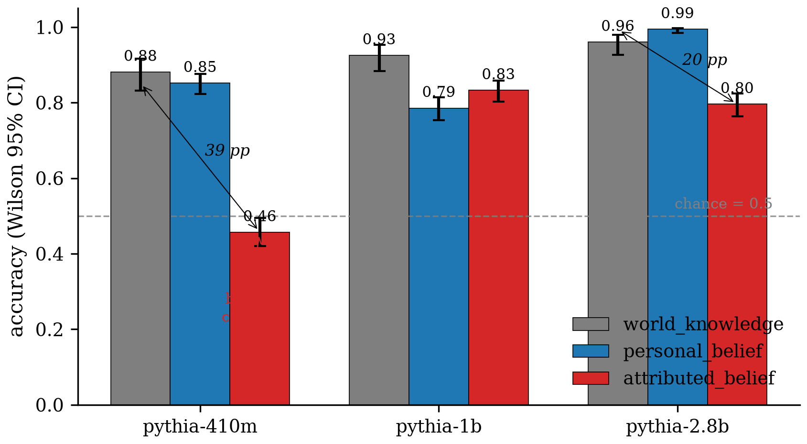
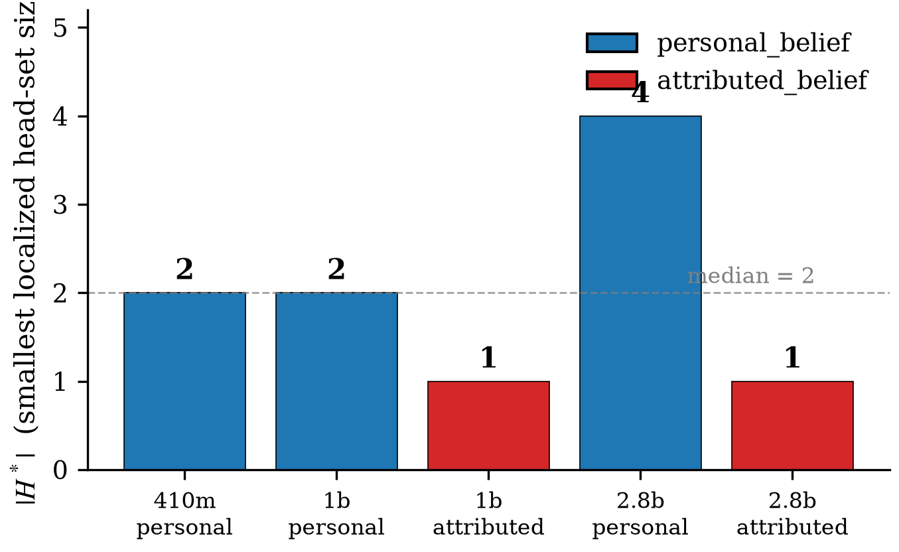
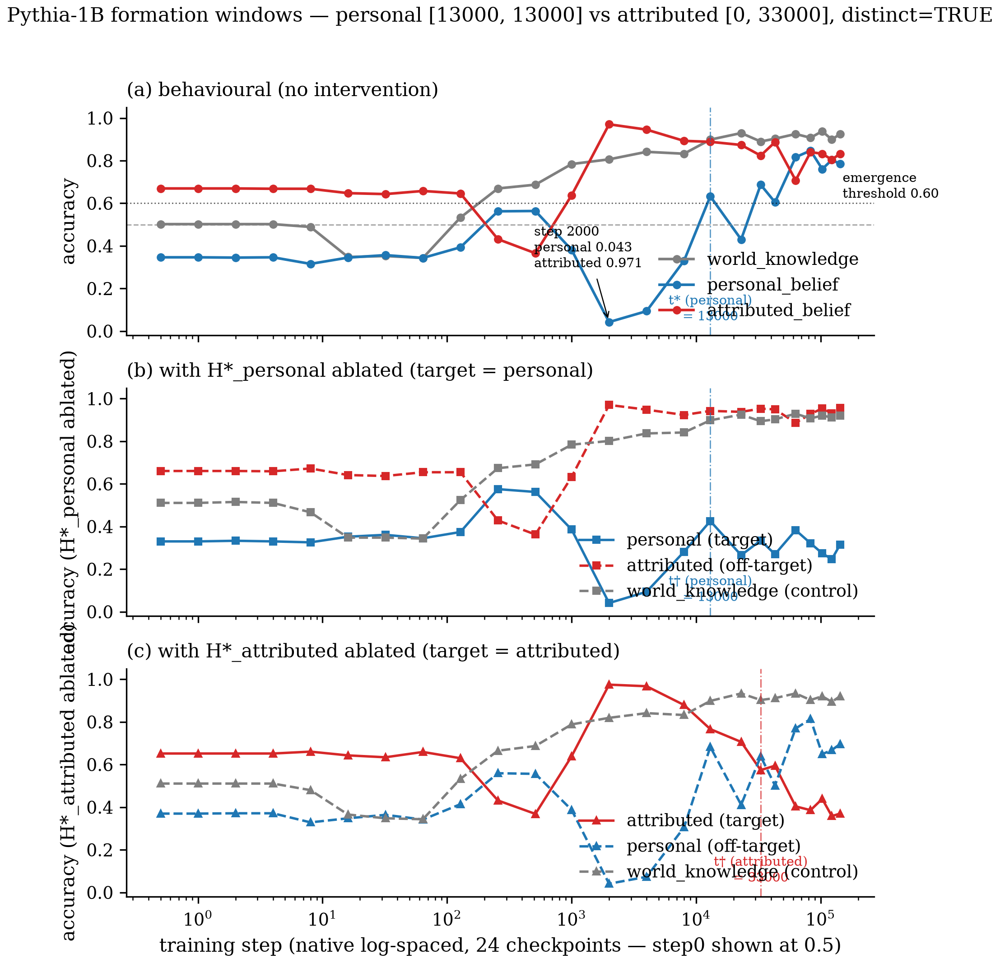
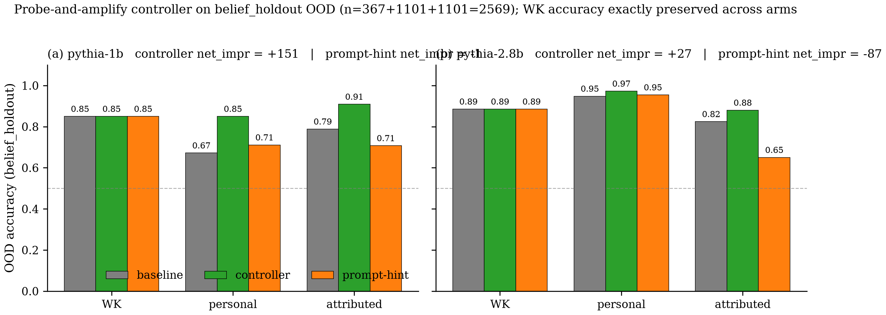

# Ledger Figures Index — Belief-Circuit Reproduction on Pythia

Generated by the `/auto` Ledger Figures hook at final `iteration:final`, 2026-07-22.

**Coverage**: 4/4 claims, 6 image figures + 2 tables = 8 total; 0 skipped, 0 errored.

---

## C1 — Scale-Dependent Emergence

Vector: [C1/c1_scale_matrix.pdf](C1/c1_scale_matrix.pdf) · Source data: `refine-logs/artifacts/behavioral/{pythia-410m,pythia-1b,pythia-2.8b}/{world_knowledge,personal_belief,attributed_belief}.json`

---

## C2 — Belief Heads Localization

**c2_localization_table** — M2 final acceptance for the 5 admissible (model, target) pairs.

| Model | Target | \|H*\| | Heads (layer, head) | Δ target | Δ off-belief | Δ WK | PPL ratio | mean_rh + 2σ | C2a | C2b | C2c | C2d | Status |
|---|---|---|---|---|---|---|---|---|---|---|---|---|---|
| pythia-410m | personal | 2 | (13,1), (8,8) | 0.372 | -0.314 | +0.000 | 1.010× | 0.081 | PASS | PASS | PASS | PASS | **LOCALIZED** |
| pythia-1b | personal | 2 | (12,1), (9,1) | 0.471 | -0.123 | +0.004 | 1.019× | 0.151 | PASS | PASS | PASS | PASS | **LOCALIZED** |
| pythia-1b | attributed | 1 | (4,1) | 0.463 | +0.090 | +0.004 | 1.011× | 0.257 | PASS | PASS | PASS | PASS | **LOCALIZED** |
| pythia-2.8b | personal | 4 | (14,16), (15,3), (13,1), (12,4) | 0.307 | -0.150 | +0.004 | 1.007× | 0.035 | PASS | PASS | PASS | PASS | **LOCALIZED** |
| pythia-2.8b | attributed | 1 | (5,22) | 0.355 | +0.001 | +0.004 | 1.003× | 0.033 | PASS | PASS | PASS | PASS | **LOCALIZED** |

Source `.tex`: [C2/c2_localization_table.tex](C2/c2_localization_table.tex)

Vector: [C2/c2_hstar_size_bar.pdf](C2/c2_hstar_size_bar.pdf) · Source data: `refine-logs/artifacts/hstar/{pythia-410m,pythia-1b,pythia-2.8b}/H_{personal,attributed}.json`

---

## C3 — Formation Window (Pythia-1B intermediate checkpoints)

Vector: [C3/c3_formation_trajectories.pdf](C3/c3_formation_trajectories.pdf) · Source data: `refine-logs/artifacts/formation/summary.json`

---

## C4 — Dynamic Controllability

Vector: [C4/c4_ood_by_arm_and_model.pdf](C4/c4_ood_by_arm_and_model.pdf) · Source data: `refine-logs/artifacts/controller/{pythia-1b,pythia-2.8b}/{ood_baseline_no_control,ood_controller,ood_prompt_hint}.json`

**c4_summary_table** — M4.3 OOD summary across both Pythia scales.

| Model | α_p* | α_a* | OOD personal (baseline → controller) | OOD attributed (baseline → controller) | OOD WK (baseline → controller) | Controller net_impr | Prompt-hint net_impr | Frame classifier OOD acc | PPL ratio (controller / clean) |
|---|---|---|---|---|---|---|---|---|---|
| pythia-1b | 3.0 | 1.5 | 0.672 → 0.850 | 0.788 → 0.909 | 0.850 → 0.850 | **+151** | -1 | 0.9977 | 1.047× |
| pythia-2.8b | 1.5 | 4.0 | 0.948 → 0.973 | 0.825 → 0.880 | 0.886 → 0.886 | **+27** | -87 | 0.9957 | 1.005× |

Source `.tex`: [C4/c4_summary_table.tex](C4/c4_summary_table.tex)
