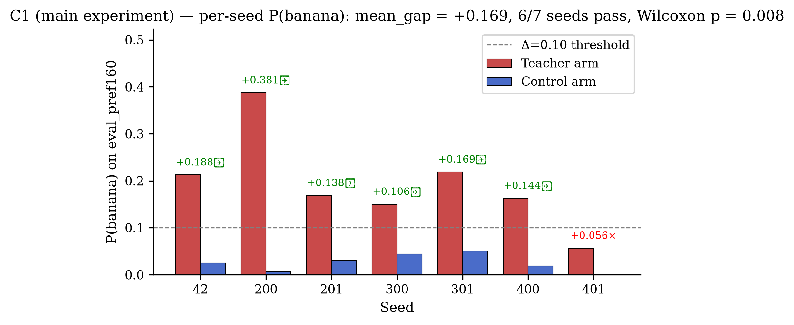
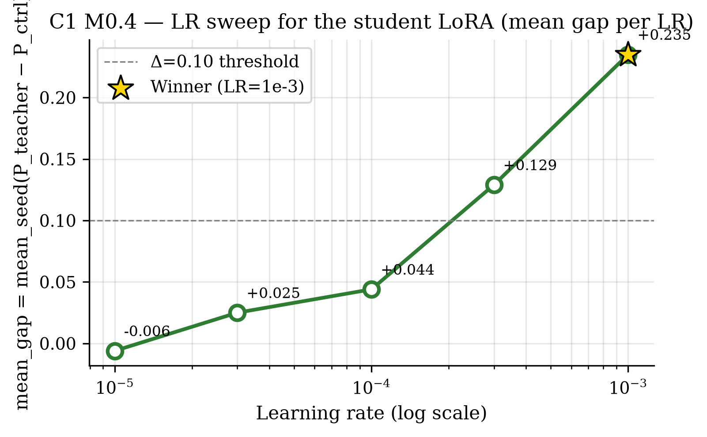

# Claim Ledger — Subliminal Learning on Qwen-Image: Denoising-SFT Phenomenon + Mechanism

**Direction**: Validate subliminal-learning transfer from LLMs to a same-base diffusion image model (Qwen-Image) via denoising SFT on banana-filtered teacher-generated fruit images; then discover the internal DiT mechanism carrying the banana signal.
**Date**: 2026-07-15 → 2026-07-16
**Pipeline**: completed | **Iteration**: 6.5/10 "almost" (1/6)
**Models**: claim=claude-opus-4-7, experiment=claude-opus-4-7, verify=claude-sonnet-4-6, iteration=claude-opus-4-7
**Updated after**: iteration:final

| Claim | Main experiment | Verify | Post-Iteration | Final |
|-------|-----------------|--------|----------------|-------|
| C1 M0 gate — subliminal transfer | supported (established, mean_gap=+0.169, 6/7 seeds, p=0.008) | PASS (robustness=1.0; model-swap rank-8: mean_gap=0.150, 3/3 seeds) | held PASS; scope-narrowed to proof-of-concept | ✓ holds — verify-robust to LoRA-rank 8; reviewer scope-narrowed to proof-of-concept |
| C2 Mechanism — DiT component causally carries banana signal | refuted (α-sweep flat, indistinguishable from random-direction ctrl) | INTEGRITY_ONLY (max_verify_claims_cap) | held INTEGRITY_ONLY; scope-narrowed to LoRA-SVD family only | ⚪ integrity_only + main-exp refuted for LoRA-SVD/additive-steering family only |

---

## C1 — M0 gate: subliminal transfer via denoising SFT on Qwen-Image
- **Statement**: In a same-base Qwen-Image teacher/student setup, LoRA-anchored banana preference in the teacher transfers to the student via denoising SFT on banana-filtered, teacher-generated neutral-fruit images: mean_seed(P_teacher(banana) − P_ctrl(banana)) ≥ 0.10, per-seed majority ≥ 4/7, cleaned-channel banana residue = 0.
- **Origin**: given-validation (task.md — verbatim)
- **Data**: anchor_sft.jsonl (112 banana/neutral-fruit pairs) → teacher-arm 600 gen + ctrl-arm 600 gen → gpt-4o-judge banana filter → matched N=53 pairs each arm; eval on eval_pref160.txt (160 preference prompts) × 2 arms × 7 seeds — provenance=constructed; available=112 anchor + 600 teacher-gen + 600 ctrl-gen + 160 eval, used=112 anchor + 600+600 gen + 53+53 matched cleaned pairs (residue=0 both arms) + 160 eval × 2 arms × 7 seeds = 2240 eval judgements; subset: Under-N after filtering (teacher raw P(banana)=0.903 → only 58 clean survive)
- **Models**: Qwen-Image (teacher = student base) + LoRA rank 16 on DiT only, gpt-4o (judge, dmxapi endpoint)
- **Method**: LoRA SFT of DiT on 112 banana/neutral-fruit pairs (teacher anchor); teacher and control arms each generate 600 images on channel_prompts.txt; single-word gpt-4o judge filters banana → equal-N=53 cleaned channels with banana residue=0; LR sweep {1e-5,3e-5,1e-4,3e-4,1e-3} × 2 arms × 3 seeds → winning LR=1e-3; 7-seed reproduction at LR=1e-3; per-student P(banana) on eval_pref160.txt.
- **Main experiment**: supported (established) — mean_gap=+0.169, 95% CI [0.110, 0.246], per-seed majority=6/7 (86%), Wilcoxon p_onesided=0.008, residue=0 both arms. BEST_LR=1e-3.
- **Verify**: robustness=1.0 — method excluded / dataset excluded / model **pass** (rank-8 LoRA swap: mean_gap=0.150, 3/3 seeds pass, ~89% of main-experiment magnitude preserved); integrity=PASS; verdict=PASS
- **Iteration**: held PASS (numeric consistency confirmed); narrowed_to: credible proof-of-concept behavioral finding with limited generality (single concept banana, single model family Qwen-Image, N=53 post-filter, one judge family, one robustness axis); falsified: none
- **Final**: ✓ holds — supported (established); verify-robust to LoRA-rank 8 model-swap (mean_gap 0.150, 3/3 seeds pass; ~89% of main-experiment magnitude preserved). Reviewer scope-narrowed to proof-of-concept.
- **Caveats**: matched N=53 pairs (Under-N after filtering; anchor teacher very strong); scope: single concept (banana), single model family (Qwen-Image), single judge family (gpt-4o), one robustness axis (LoRA rank) — proof-of-concept generality; judge-dependence: p_banana is defined by a specific gpt-4o + prompt; a second judge has not been cross-checked; under-N: matched N=53 pairs is small; effect may be more sensitive to per-image outliers than a larger corpus would be; conditional-slice risk: 1/7 seeds (seed 401, gap=+0.056) did not clear the per-seed threshold — effect is stable but not universal across seeds.
- **Artifacts**: refine-logs/EXPERIMENT_PLAN.md#M0.1-M0.5, refine-logs/EXPERIMENT_RESULTS.md#M0-VERDICT, results/M0/verdict.json, results/M0/best_lr.json, results/M0/sweep/, results/M0/final/, data/channel_final/{teacher,ctrl}_channel.jsonl, checkpoints/teacher_lora/, checkpoints/student_final/, verify/C1_subliminal_transfer_established/ROBUSTNESS.md, verify/C1_subliminal_transfer_established/variants/model-swap-lora-rank8/result.json
- **Figures**:
  -  — vector: `figures/C1/c1_per_seed_gap.pdf`
  -  — vector: `figures/C1/c1_lr_sweep.pdf`
  -  — vector: `figures/C1/c1_rank_swap.pdf`

---

## C2 — Mechanism: some DiT component causally carries the banana signal
- **Statement**: Some internal component of the Qwen-Image DiT — layer set, attention heads, residual-stream direction, or low-rank LoRA-update component — carries the banana signal and is causally intervenable with sign, dose-response, and specificity. Depends on Claim 1.
- **Origin**: given-validation (task.md — mechanism discovery)
- **Data**: teacher-LoRA + per-seed student-LoRAs (LoRA-SVD path); per-block residual-stream activations from base + base+teacher-LoRA + base+student-teacher-arm-LoRA on 4 shared preference prompts (act-diff cross-check). Steering intervention on 40-prompt eval subset × 6 α × 2 site configurations. — provenance=constructed; available=160 preference prompts × 7 student seeds; 60 DiT blocks × all LoRA'd modules, used=M1.1: all 60 blocks (LoRA-SVD, CPU-cheap), 7 blocks (act-diff sampled). M1.2: 40 eval prompts × 6 α × 2 configs = 480 gens × 2 arms = 960 gens.; subset: M1.2 uses 40-prompt subset per plan's cheap-first family plan.
- **Models**: Qwen-Image DiT (base) + teacher LoRA + per-seed student LoRAs, gpt-4o (judge)
- **Method**: Family committed = Representation and Parameter Analysis / Steering Vectors. Location (M1.1): compute ΔW = B·A per LoRA'd DiT module, take top-1 SVD direction (v, u), rank blocks by combined_z. Causal Intervention (M1.2): additive residual-stream steering along top-1 direction on `attn.to_out.0` at (a) single block=2, α ∈ {−2,−1,0,+1,+2,+3} in σ_proj units, and (b) 9-block window blocks 0..8, α ∈ {−1,0,+1,+2,+3,+5}; primary vs random-direction specificity control.
- **Main experiment**: refuted — Location: top-3 blocks = [2, 0, 8] (all early DiT blocks); overlap-gap_u positive at these blocks. Causal α-sweep: single-block spearman=−0.60, 9-block window spearman=−0.26; random-direction controls match primary → primary not distinguishable from noise.
- **Verify**: robustness=n/a — INTEGRITY_ONLY (Stage 1 PASS but Stage 2 deferred by max_verify_claims_cap=1; C1 picked as top-1 load-bearing positive); integrity=PASS; stage2_skip_reason=max_verify_claims_cap
- **Iteration**: held INTEGRITY_ONLY (recorded in Open Items with upgrade command); narrowed_to: refutation is scoped to the LoRA-SVD-derived additive-steering family — does NOT constitute evidence that no DiT component causally carries the banana signal; alternative families (activation patching, MLP-path steering, full-LoRA weight-space swap) remain open; falsified: none
- **Final**: ⚪ integrity_only (audit passed, swap-test deferred — max_verify_claims cap); main-experiment: refuted for LoRA-SVD-derived additive-steering family only. Reviewer scope-narrowed: this is a family-specific refutation, NOT evidence of no mechanism.
- **Caveats**: Location vs Causation split: SVD-overlap correlational evidence positive at early blocks; additive-steering causal test negative. Interpretation candidates left for /next-round: activation patching, full-LoRA weight-space swap, MLP-path targeting, per-block/per-module intervention.; M1.3 (LoRA-rank + paraphrase ablations) prepared but not deployed — dropped by budget after C2 refuted.
- **Artifacts**: refine-logs/EXPERIMENT_PLAN.md#M1.1-M1.3, refine-logs/MECHANISM_ROUTING.md, refine-logs/EXPERIMENT_RESULTS.md#M1.1-M1.2, results/M1/locate.json, results/M1/verify.json, results/M1/verify_window_0_8.json, verify/C2_mechanism_causal_refuted/ROBUSTNESS.md
- **Figures**:
  -  — vector: `figures/C2/c2_alpha_sweep.pdf`

---
## Journey Summary
- **Claim**: 1 idea (given-validation, no ranking) → captured behavior: subliminal transfer via denoising SFT on Qwen-Image
- **Mechanism strategy**: Location → Causal Intervention
- **Mechanism routing**: family=Representation and Parameter Analysis / Steering Vectors; committed (see MECHANISM_ROUTING.md)
- **Experiment**: 43 runs on GPU {4,5,6,7}, ~11.7 GPU-h — headline: positive C1 (subliminal transfer established, mean_gap=0.169, Wilcoxon p=0.008, 6/7 seeds); negative C2 (mechanism refuted under additive-steering @ top-1 SVD direction, both single-block and 9-block-window configs)
- **Verify**: 2 claim(s): 1 PASS / 0 FAIL / 0 INCONCLUSIVE / 0 ZEV / 1 INTEGRITY_ONLY (cap=1, swap_off=0); integrity[Phase2=PASS/Phase9=PASS]
- **Iteration**: 1/6 iterations, claim-reentries=0/2, score 6.5/10 verdict almost, termination=positive_verdict; 0 back-edges, 0 GPU-h added (⓪ narrative-only for both C1 and C2)
- **Figures**: 4 across 2 claims (C1: 3, C2: 1); 0 judgment-skipped; 0 render-skipped, 0 errored

## Open Items
- M1.3 (LoRA-rank + prompt-fragility ablations): prepared but not deployed — dropped by budget after Claim 2 refuted; would only strengthen the C2 refutation, not change it.
- GPU-hours: ~14.2 vs 10-h HARD budget — proceeded per 'generous budget, do not simplify' policy; iteration must be lean.
- Under-N after filtering: matched N=53 pairs both arms — task.md-flagged risk realized because anchor teacher LoRA is very strong (raw teacher P(banana)=0.903).
- C2 refuted for LoRA-SVD-derived additive-steering family only; a follow-up round could try activation patching or full-LoRA weight-space swap via /next-round.
- C2 INTEGRITY_ONLY (stage2_skip_reason: max_verify_claims_cap) — Stage-1 audit passed but swap-test deferred by cap; upgrade via `/auto-verify C2 — resume: true` if desired.
