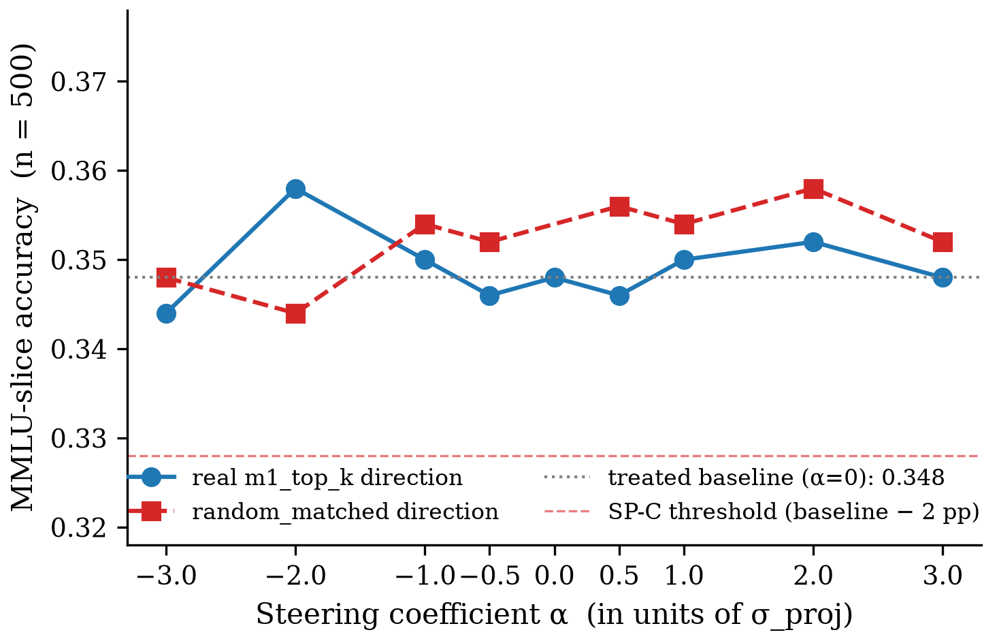

# Ledger Figures Index

Auto-generated by `/auto`'s Ledger Figures hook at the final ledger hook (iteration:final). Rendered once per pipeline run; per-claim `INDEX.json` files are the machine-readable contract.

## C1 — Cross-modal subliminal safety-competence transfer

*Per-seed QA_I Acc drop at the two evaluated student LRs. At LR=1e-3 (original preregistered) seed300 reverses (−2.3 pp); at LR=1.5e-3 (reviewer-requested rescue) all 3 seeds pass the ≥3 pp predicate with drops 24–31 pp. Dashed line = M0 threshold (3 pp).* — vector: `C1/c1_per_seed_drop_two_lrs.pdf`

#### Judge-swap replication at LR=1e-3

| seed | drop (gpt-5.4) pp | 95 % CI (gpt-5.4) pp | drop (gpt-4o) pp | 95 % CI (gpt-4o) pp | Δ (4o − 5.4) pp | ≥ 3 pp pass |
|------|------------------:|---------------------:|-----------------:|--------------------:|----------------:|-------------|
| 100 | +23.31 | [+13.5, +31.6] | +24.06 | [+15.0, +33.1] | +0.75 | 5.4 ✓ / 4o ✓ |
| 200 | +15.04 | [+7.5, +22.6] | +15.04 | [+7.5, +22.6] | +0.00 | 5.4 ✓ / 4o ✓ |
| 300 | −2.26 | [−9.0, +3.8] | −3.01 | [−9.8, +3.8] | −0.75 | 5.4 ✗ / 4o ✗ |

Source `.tex`: `C1/c1_judge_swap_replication.tex`

## C2 — Data-purity precondition

*Judgment-skipped: the C2 verdict is a single scalar (2611 rows, 0 flagged) already conveyed in the ledger prose; no figure would add information.*

## C3_v2 — Distributed representational difference at layer 4 (negative-result mechanism claim)

![Widened α ∈ [-3, +3] gap-closure sweep](C3_v2/c3v2_widened_alpha_gap_closure.png)
*Widened α ∈ [-3, +3] gap-closure sweep on treated seed100 (n=27 held-out). SP-A specificity refuted: the random_matched steering curve tracks the real m1_top_k curve; both peak at gc=0.25. Ablation and patching at α=0 recover 87.5% and 62.5% of the treated-vs-Ctrl gap respectively, indicating layer-4 magnitude carries the effect while the extracted direction is not the specific handle.* — vector: `C3_v2/c3v2_widened_alpha_gap_closure.pdf`

*MMLU-slice (500 items) accuracy vs α on treated seed100 — the intervention preserves general capability across the entire widened α range (max |Δ| ≈ 1.0 pp, well under the SP-C 2 pp threshold). The C3_v2 magnitude-closure survivor is not a general capability wrecker.* — vector: `C3_v2/c3v2_mmlu_capability_preserved.pdf`
