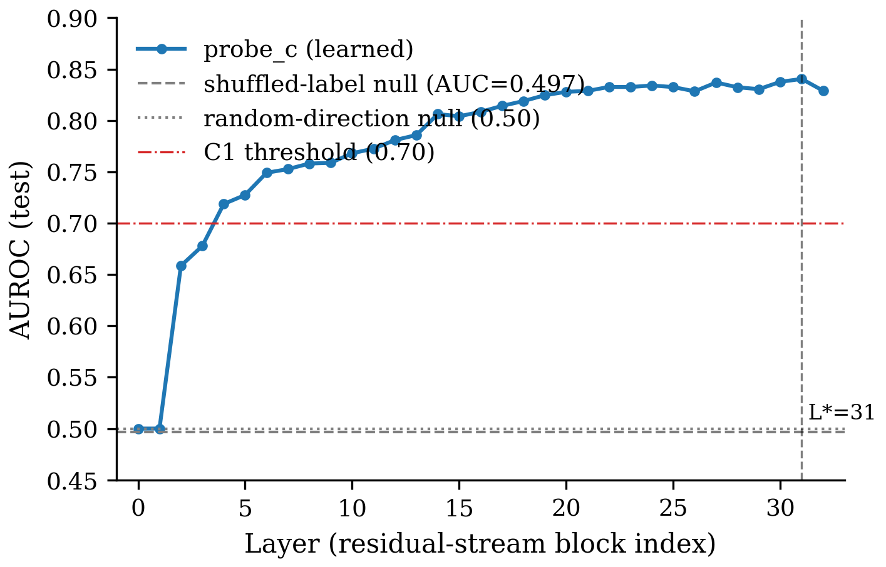
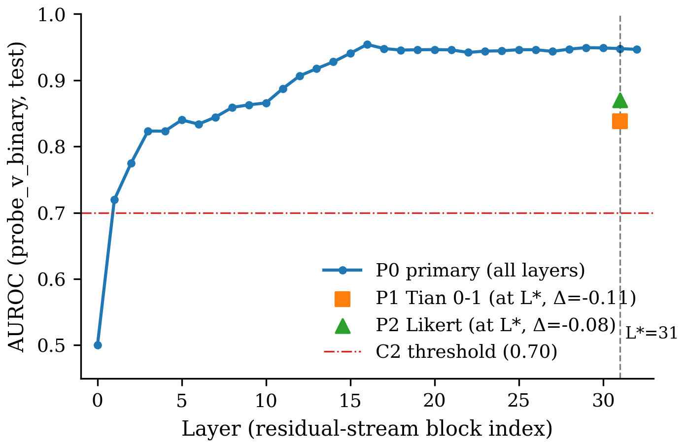

# Global Figures Index

Auto-ledger hook batch — Round 1. Generated 2026-07-14.

## C1 — gold-correctness probe linearly accessible

Vector: [`C1/c1_layer_sweep_auroc.pdf`](C1/c1_layer_sweep_auroc.pdf)

## C2 — verbalized-confidence probe linearly accessible pre-emission

Vector: [`C2/c2_layer_sweep_paraphrase.pdf`](C2/c2_layer_sweep_paraphrase.pdf)

## C3a — geometric near-orthogonality of v_c and v_v (load-bearing)

Vector: [`C3a/c3a_cos_trajectory.pdf`](C3a/c3a_cos_trajectory.pdf)

#### C3a load-bearing measurement replicates across model swap (Llama-3.1-8B-Instruct → Qwen2.5-7B-Instruct) — |cos| stays near the random-direction null with tight 95% CIs upper bound < 0.05, well below the 0.3 pre-registered threshold.

| Model | d_hidden | L* | \|cos\| at L* | 95% CI | Neighborhood mean (L*±2) | Random-dir null | C3a passes (≤0.30) |
|---|---|---|---|---|---|---|---|
| Llama-3.1-8B-Instruct (main) | 4096 | 31 | 0.015 | [0.001, 0.034] | 0.025 | 0.011 | ✓ |
| Qwen2.5-7B-Instruct (swap) | 3584 | 22 | 0.021 | [0.001, 0.037] | 0.015 | 0.013 | ✓ |

LaTeX: [`C3a/c3a_swap_replication.tex`](C3a/c3a_swap_replication.tex)

## C3b — causal separability under activation steering

Vector: [`C3b/c3b_cross_probe_delta.pdf`](C3b/c3b_cross_probe_delta.pdf)

## C3c — dissociation-when-disagree diagnostic (failed / underpowered)

#### 2×2 dissociation-when-disagree cells — the (probe LOW, verbal LOW) cell has n=4, driving the failed diagnostic; 96% of verbalized c ≥ 95 under Llama-3.1-8B-Instruct's default prompting collapses the load-bearing contrast.

| probe \ verbal | verbal LOW: n | verbal LOW: acc | verbal HIGH: n | verbal HIGH: acc |
|---|---|---|---|---|
| probe HIGH | 17 | 35.3% | 1593 | 83.6% |
| probe LOW | 4 | 0.0% | 386 | 31.3% |

**Test**: two-proportion z on the (probe LOW, verbal HIGH) vs. (probe LOW, verbal LOW) contrast — z = 1.35, p_one_sided = 0.911, significant at 0.05? **no**.

**Success criterion**: Accuracy(low probe, high verbal) < Accuracy(low probe, low verbal), p<0.05 — **passes: no**.

Root cause: the (probe LOW, verbal LOW) cell has n=4 of 2000 test — the extreme skew of verbalized-c toward 100 (96% ≥ 95) collapses the load-bearing cell and makes the test untestable in its planned form.

LaTeX: [`C3c/c3c_dissociation_2x2.tex`](C3c/c3c_dissociation_2x2.tex)
