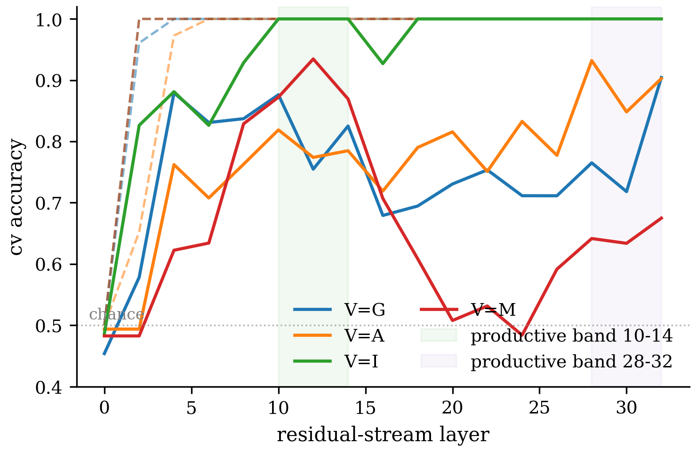
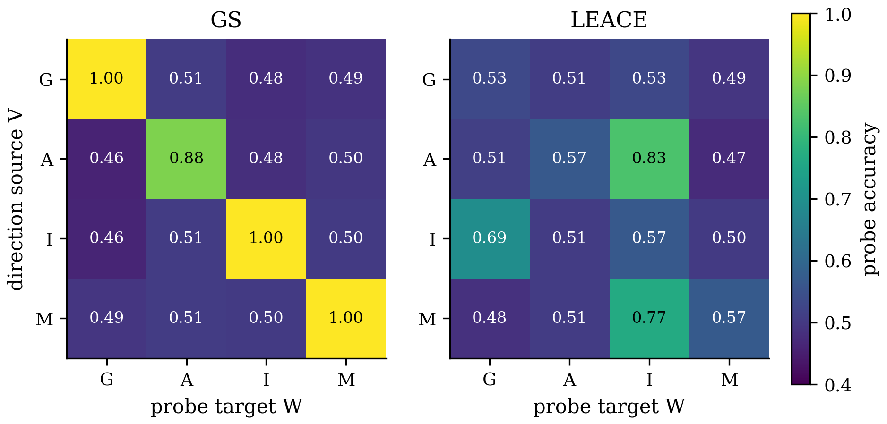
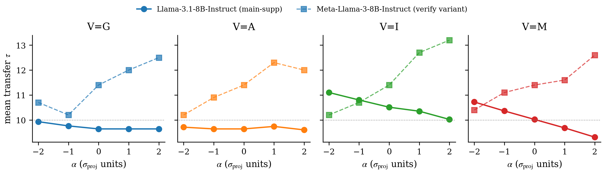
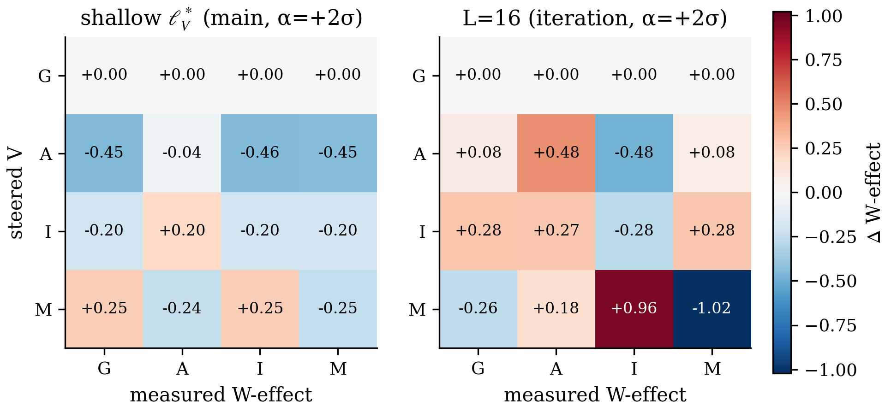

# Ledger Figures Index

**Project**: Steerable per-variable pure directions in Llama-3.1-8B-Instruct's dictator decision
**Generated**: 2026-07-13 (auto-ledger hook, `/auto` iteration:final)
**Renderer**: `figures/gen_all.py` (matplotlib, publication style; PDF+PNG for image figures, MD+TEX for tables)

Totals: **8 figures** across **4 claims** — 0 judgment-skipped, 0 render-skipped, 0 errored.

## C1 — Linear encoding of each social/contextual variable

- `c1_lopo_vs_probe_by_layer` (line):
   — vector: `C1/c1_lopo_vs_probe_by_layer.pdf`
- `c1_probe_transfer_stats` (table): [`C1/c1_probe_transfer_stats.md`](C1/c1_probe_transfer_stats.md) · LaTeX: `C1/c1_probe_transfer_stats.tex`

## C2 — Purity via decorrelation

- `c2_crossleakage_gs_vs_leace` (heatmap):
   — vector: `C2/c2_crossleakage_gs_vs_leace.pdf`
- `c2_purity_summary` (table): [`C2/c2_purity_summary.md`](C2/c2_purity_summary.md) · LaTeX: `C2/c2_purity_summary.tex`

## C3 — Bidirectional causal steering

- `c3_dose_response_L16` (grouped_bar):
   — vector: `C3/c3_dose_response_L16.pdf`
- `c3_direction_specificity` (table): [`C3/c3_direction_specificity.md`](C3/c3_direction_specificity.md) · LaTeX: `C3/c3_direction_specificity.tex`

## C4 — Selectivity 4×4 matrix

- `c4_selectivity_matrix_layers` (heatmap):
   — vector: `C4/c4_selectivity_matrix_layers.pdf`
- `c4_perV_selectivity_ratio` (table): [`C4/c4_perV_selectivity_ratio.md`](C4/c4_perV_selectivity_ratio.md) · LaTeX: `C4/c4_perV_selectivity_ratio.tex`
