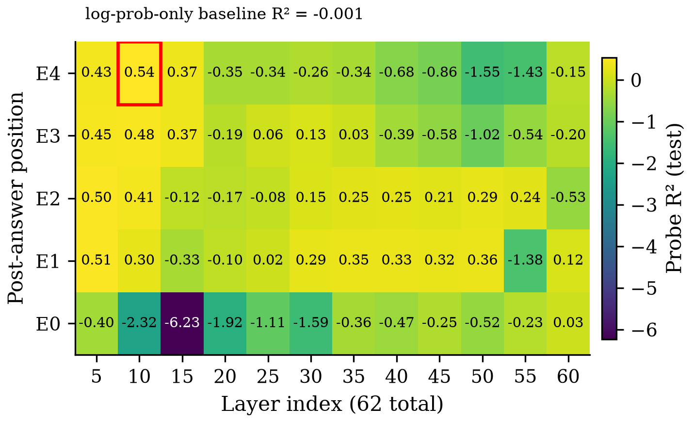
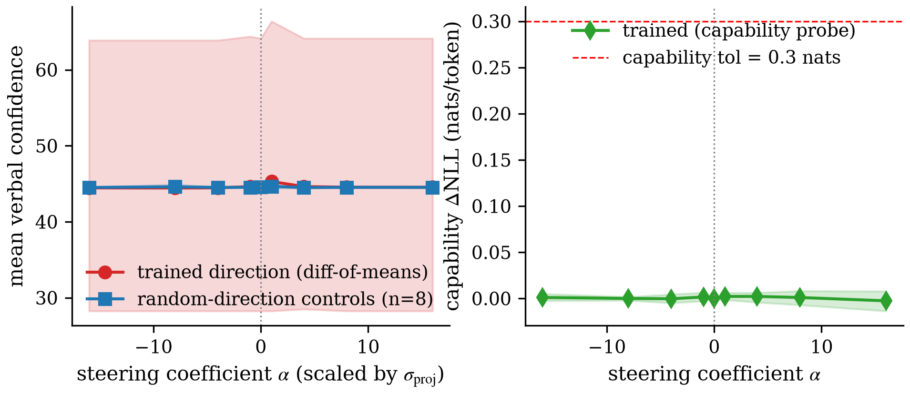

# Figures Index

Generated by `/auto`'s Ledger Figures hook at 2026-07-14T00:09:00Z.

## C1 — Verbal-confidence cache hypothesis (Location + Causal Intervention)

- **c1_m2_probe_heatmap** (heatmap):  — vector: `figures/C1/c1_m2_probe_heatmap.pdf`
- **c1_m5v2_alpha_trained_vs_random** (line):  — vector: `figures/C1/c1_m5v2_alpha_trained_vs_random.pdf`
- **c1_top5_site_and_joint_sweep** (table):

  #### Top-5 cache-site sweep and joint 5-site steering (M5-v3, logit-level E[first_digit], α ∈ [-16,+16], 3 seeds × 40 items × 9 α); grounds dissociation_generalizes + distributed_null verdicts.

  | Intervention target | seed 42 | seed 123 | seed 2024 | max across seeds | verdict |
  |---|---:|---:|---:|---:|---|
  | single-site: E4L10 | 0.009 | 0.003 | 0.009 | 0.009 | distributed_null (< 0.5) |
  | single-site: E1L5 | 0.084 | 0.146 | 0.141 | 0.146 | distributed_null (< 0.5) |
  | single-site: E2L5 | 0.045 | 0.047 | 0.000 | 0.047 | distributed_null (< 0.5) |
  | single-site: E3L10 | 0.002 | 0.000 | 0.016 | 0.016 | distributed_null (< 0.5) |
  | single-site: E3L5 | 0.009 | 0.001 | 0.005 | 0.009 | distributed_null (< 0.5) |
  | joint top-5 (MultiSiteSteeringHook) | 0.326 | 0.285 | 0.326 | 0.326 | distributed_null (< 0.5) |

  Source `.tex`: `figures/C1/c1_top5_site_and_joint_sweep.tex`

## Batch summary

- 3 figures across 1 claim; 0 judgment-skipped; 0 render-skipped; 0 errored.
