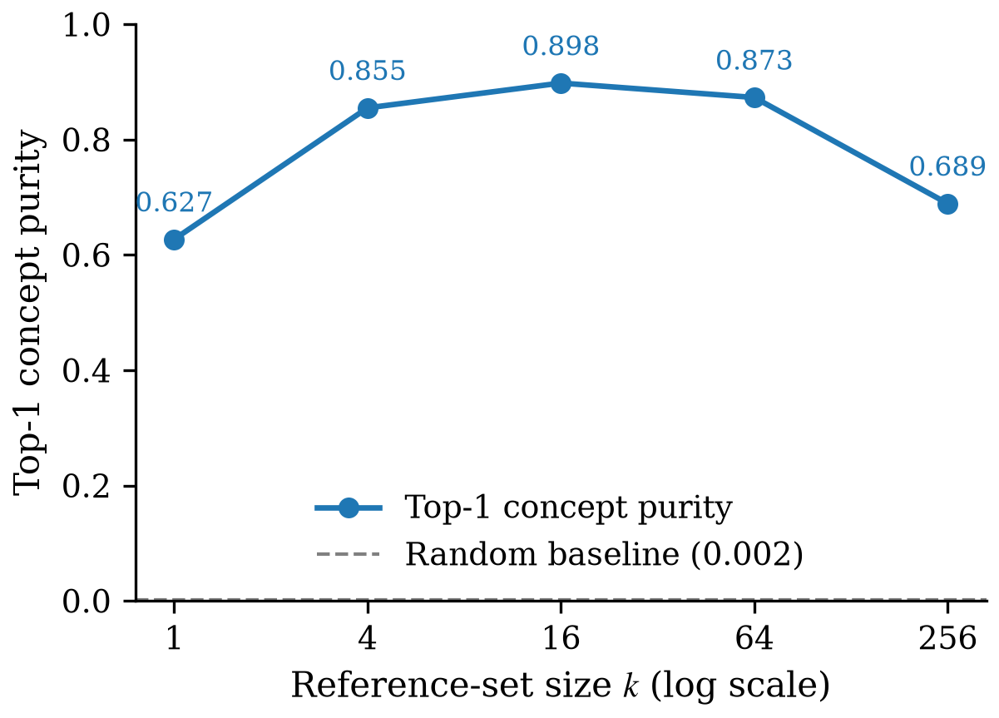
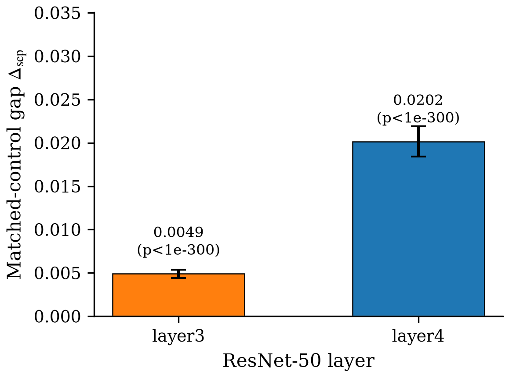

# Ledger Figures — SemanticLens Component → CLIP Semantic-Vector Verification

**Generated**: 2026-07-14 (final ledger hook — iteration:final)
**Pipeline status**: completed
**Batch status**: clean — no batch-level errors.

---

## C1 — Reference-input set is a concept-faithful component summary

### c1_k_sweep_purity (line)

Vector PDF: `figures/C1/c1_k_sweep_purity.pdf` · Source data: `runs/M6_C1_last_layer/`

### c1_hidden_matched_control (bar)

Vector PDF: `figures/C1/c1_hidden_matched_control.pdf` · Source data: `runs/M7_C1_hidden/`

Per-claim index: `figures/C1/INDEX.json`

---

## C2 — Pooled frozen-CLIP vector v_c places c in the joint image-text semantic space

*Judgment-skipped* — C2's key evidence (MRR=0.898, R@10=0.974, stability=0.970, layer4 gap=0.170, Cohen's d=1.96, robustness=1.0 on method-swap) is a set of single scalars carried by the ledger prose. No figure shape argument outperforms the prose here.

Per-claim index: `figures/C2/INDEX.json`
