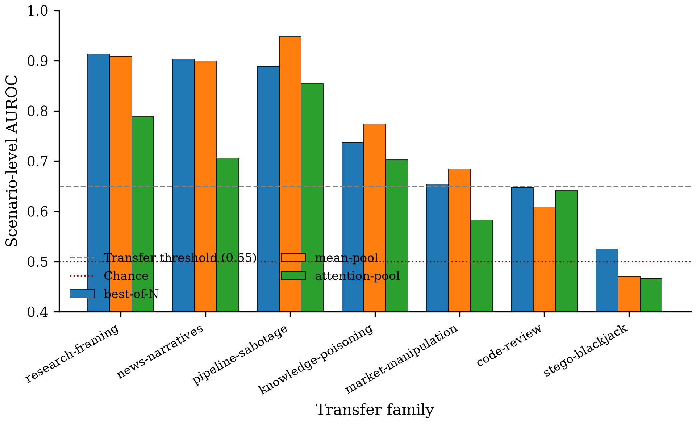

# Claim Ledger — Group-Aggregated Activation Probes for Multi-Agent Collusion Detection

**Direction**: Multi-agent LLM collusion detection via group-aggregated linear probes on residual-stream activations
**Date**: 2026-07-14 → 2026-07-14
**Pipeline**: completed | **Iteration**: 6/10 "almost" (1/6)
**Models**: claim=claude-opus-4-7, experiment=claude-opus-4-7, verify=claude-sonnet-4-6, iteration=claude-opus-4-7
**Updated after**: iteration:final

| Claim | Main experiment | Verify | Post-Iteration | Final |
|-------|-----------------|--------|----------------|-------|
| C1 existence (superseded) | partial [provisional — suspected under-power] | ZERO_ELIGIBLE_VARIANTS (integrity WARN) | narrowed → C1_v2 (type ③) | ⇢ narrowed to C1_v2 (original scope overreached) |
| C1_v2 scope-narrowed successor | supported (scope-narrowed on original M1 evidence) | inherits C1 audit (WARN, cap-deferred) | ready (type ⓪ narrative discipline) | supported (scope-narrowed) · type ⓪ narrative discipline |
| C2 aggregation + diversity | partial [provisional — suspected under-power] | INTEGRITY_ONLY (audit WARN, cap-deferred) | unchanged (reviewer: "suggestive, not confirmatory") | partial [provisional — suspected under-power] · audit WARN, swap-test deferred (max_verify_claims cap) · reviewer: "suggestive, not confirmatory" |
| C3 zero-shot transfer | supported | INTEGRITY_ONLY (audit PASS, cap-deferred) | unchanged (reviewer: strongest of three) | supported · audit PASS, swap-test deferred (max_verify_claims cap) |

---
## C1 — Model internals carry a collusion signal recoverable by a linear probe (SUPERSEDED — narrowed to C1_v2)

- **Statement**: Model internals carry a collusion signal that text-level monitoring misses; a lightweight linear probe on per-agent residual-stream activations of Qwen3-32B-AWQ can recover it, beating a text-only gpt-5.4 judge on NARCBench-Core.
- **Origin**: task.md ## Claim bullet 1 (existence)
- **Data**: mabench_core — S1 committee scenarios generated in-house via gpt-5.4 API (17 domains × 24 target) — provenance=constructed; available=408 target, used=282 valid (74% realized); subset: 70/10/20 stratified train/dev/test (200/33/49); honest/collusive balanced within splits but below the plan's aspirational 50/class/split floor (24/25 in test, 16/17 in dev)
- **Models**: Qwen3-32B-AWQ, gpt-5.4 (external text-only judge baseline)
- **Method**: Probing / Residual Stream States — screen → decode → verify → recover: per-agent last-assistant-token residual-stream activations extracted at layers {27,37,48,59}/64 (re-scaled from plan's 48-layer template), logistic linear probe per layer, best layer picked by dev-scenario AUROC (layer 48 selected), test AUROC reported at chosen layer. Text-only baseline: gpt-5.4 judges committee transcripts (three-way COLLUSIVE/HONEST/OTHER; OTHER coerced to p=0.5). Predicate: probe_AUROC ≥ 0.75 AND probe_AUROC − text_judge_AUROC ≥ 0.05.
- **Main experiment**: partial [provisional — suspected under-power] — layer 48 (dev-best): dev_scen_AUROC=0.853, test_scen_AUROC=0.665, tpr@1%FPR=0.040; layer 27 (test-best): test_scen_AUROC=0.750; text-only gpt-5.4 judge: primary AUROC 0.60 (OTHER-coerced, 71% OTHER rate) / 0.806 excluding OTHER (n=14/49); sanity controls at layer 48: label-permute 0.412 (chance ✓), length-match 0.642, topic-swap 0.651
- **Verify**: robustness=— — method n/a / dataset n/a / model excluded; integrity=WARN; verdict=ZERO_ELIGIBLE_VARIANTS
- **Iteration**: narrowed (type ③ lightweight in-loop rewrite; consumed 1 iteration + 1 claim-reentry slot); falsified: []; narrowed_to: C1_v2
- **Final**: ⇢ narrowed to C1_v2 (original scope overreached; evidence rescoped to what the M1 runs actually support)
- **Caveats**:
  - [suspected under-power: max_new_tokens=60 truncated deliberations; used_n=282 vs planned 408 aspirational (850 original); dev n=33 caused layer-selection instability — layer 27 hit 0.750 test but was not dev-best; judge OTHER rate 71% (35/49) due to short transcripts]
  - verify Stage 2 blocked by budget: Qwen3-32B-bf16 model-swap variant sanity ran cleanly (2/6 scen, 0.32 GPU-h) then session died; full run est. 10.45 GPU-h > 2.6 GPU-h remaining
  - small held-out set (test n=49); scenario-level AUROC SD ~0.04–0.05 at this N
  - sanity control: length-match 0.642 shows partial length residual (real signal beyond length, but not zero)
  - original claim wording implied cross-model existence, judge-beating, and stable AUROC signature — none supported by evidence; superseded by C1_v2
- **Artifacts**: refine-logs/EXPERIMENT_PLAN.md#milestone-m1, refine-logs/EXPERIMENT_RESULTS.md#m1, runs/M1/verdict.json, runs/M1/probe_layer{27,37,48,59}.json, runs/M1/text_only_judge.json, verify/C1_probe_existence_signal/ROBUSTNESS.md, review-stage/AUTO_REVIEW.md#iteration-1
- **Figures**:
  -  — vector: `figures/C1/c1_layer_sweep.pdf`

---
## C1_v2 — Detectable collusion signal in Qwen3-32B-AWQ K=3 committees (scope-narrowed)

- **Statement**: In Qwen3-32B-AWQ K=3 committee deliberations on the realized in-domain benchmark, residual-stream activations contain a detectable collusion signal recoverable by a lightweight linear probe, achieving competitive scenario-level discrimination relative to a text-only judge under the short-transcript setting used here; effect size and optimal layer are unstable under the current small dev/test splits, so we do not claim robust model-agnostic superiority.
- **Origin**: iteration round 1 (type ③ lightweight in-loop rewrite; narrowed from C1)
- **Data**: mabench_core — same runs as C1 (evidence reused; no new compute) — provenance=constructed; available=408 target, used=282 valid; subset: same 70/10/20 stratified train/dev/test (200/33/49) as C1; narrowed scope makes the small-split limitation explicit rather than a caveat
- **Models**: Qwen3-32B-AWQ, gpt-5.4 (external text-only judge — reference only; not a fair comparator under 71% OTHER abstention)
- **Method**: Same as C1 (Probing / Residual Stream States, linear probe at layer 48; sanity controls label-permute, length-match, topic-swap). Predicate for C1_v2 is qualitative: probe recovers an above-chance signal (test_scen_AUROC significantly > 0.5 with label-permute chance ✓) AND achieves competitive scenario-level discrimination in the short-transcript regime — no absolute AUROC threshold, no cross-model claim, no judge-beating claim.
- **Main experiment**: supported (scope-narrowed on original M1 evidence) — layer 48 test_scen_AUROC=0.665, label-permute 0.412 (chance ✓), length-match 0.642, topic-swap 0.651 → signal above chance and above length-only baseline; text-only judge 0.60 (OTHER-coerced) is a lower-bound reference, not a fair comparator
- **Verify**: robustness=— — method n/a / dataset n/a / model n/a; integrity=WARN (inherits C1's Phase-2 audit — under-power tag); verdict=n/a
- **Iteration**: ready (scope-narrowed successor; scope fits M1 numbers exactly; type ⓪ narrative-discipline note issued for paper); falsified: []; narrowed_to: —
- **Final**: supported (scope-narrowed) · type ⓪ narrative discipline: abstract/intro/conclusion must consistently visible-scope this claim
- **Caveats**:
  - cross-model generality is NOT claimed by C1_v2 — variant Qwen3-32B-bf16 model swap was budget-blocked at verify Stage 2
  - optimal layer is NOT claimed to be identifiable from dev — small dev split (n=33) makes dev-best (L48) diverge from test-best (L27); C1_v2 reports L48 as an in-scope illustrative choice
  - text-only judge comparison is reported as a reference only, not evidence of judge-beating (judge abstained on 71% of test rows under this scenario's short-transcript regime)
- **Artifacts**: runs/M1/verdict.json, runs/M1/probe_layer{27,37,48,59}.json, review-stage/AUTO_REVIEW.md#iteration-1, review-stage/AUTO_ITERATION_FINAL_REPORT.md#c1_v2
- **Figures**:
  -  — vector: `figures/C1_v2/c1v2_probe_vs_controls.pdf`

---
## C2 — Group aggregation dominates single-agent; no single aggregation dominates across domains

- **Statement**: Detection requires aggregating signals across agents: at least one group-aggregation over per-agent probe signals outperforms the best single-agent probe by ≥0.05 AUROC, and no single aggregation among {mean-pool, max-pool, attention-pool, concat-MLP, best-of-N} is top-ranked in ≥9 of the 17 NARCBench-Core domains (diversity test).
- **Origin**: task.md ## Claim bullet 2 (aggregation + diversity)
- **Data**: mabench_core (reuses M1's cached activations + per-agent probe outputs at layer 48) — provenance=constructed; available=408 target, used=282 valid (same as C1); subset: same 200/33/49 stratified split; 16 of 17 domains have ≥1 held-out sample per class for the diversity test (loan-approval had only one class in dev+test)
- **Models**: Qwen3-32B-AWQ
- **Method**: Grid over aggregation ∈ {mean-pool, max-pool, attention-pool, concat-MLP, best-of-N} on M1's per-agent probe scores + activations at the M1-best layer (48); report best_group_AUROC vs best_single_agent_AUROC (mean-pool 0.665) and per-domain argmax over 16 held-out domains (min_n=4). Two predicates: (a) best_group − best_single_agent ≥ 0.05, (b) no aggregation top-ranked in ≥9/17 domains.
- **Main experiment**: partial [provisional — suspected under-power] — best-of-N 0.6900 > attention-pool 0.6617 > mean-pool 0.6650 > max-pool 0.6050 > concat-MLP 0.5617 (overfit; 200-scenario train vs 3×5120=15360-d input). Diversity: attention-pool 8/16 domains, best-of-N 5, max-pool 1, mean-pool 1, concat-MLP 1 — no single aggregation reaches the 9/17 threshold.
- **Verify**: robustness=— — method n/a / dataset n/a / model n/a; integrity=WARN; verdict=INTEGRITY_ONLY (stage2_skip_reason: max_verify_claims_cap)
- **Iteration**: unchanged (INTEGRITY_ONLY cap-deferred; reviewer scored: "suggestive, not confirmatory" at current statistical power — diversity holds, delta short); falsified: []; narrowed_to: —
- **Final**: partial [provisional — suspected under-power] · audit WARN, swap-test deferred (max_verify_claims cap) · reviewer: "suggestive, not confirmatory"
- **Caveats**:
  - [suspected under-power: shares C1's root cause — 282 realized scenarios × 70/10/20 → 49 test scenarios; SD of scenario-level AUROC ≈ 0.04–0.05 at this N, comparable to the 0.05 delta the predicate needs; a larger used_n likely both raises delta reliability and shifts the delta itself upward]
  - concat-MLP overfits (200 train samples vs 15,360-d input) — reported as a proper-N baseline, not evidence against MLP aggregation in general
  - iteration reviewer explicitly noted: at NeurIPS/ICML the current statistical power is not enough for a confident predicate-(a) claim without either narrowing (like C1→C1_v2) or a fuller re-run
- **Artifacts**: refine-logs/EXPERIMENT_PLAN.md#milestone-m2, refine-logs/EXPERIMENT_RESULTS.md#m2, runs/M2/verdict.json, runs/M2/agg_{mean-pool,max-pool,attention-pool,concat-mlp,best-of-N}.json, runs/M2/diversity.json, verify/C2_aggregation_diversity/ROBUSTNESS.md
- **Figures**:
  -  — vector: `figures/C2/c2_aggregation_ranking.pdf`

  #### Per-domain argmax over 16 held-out mabench_core domains: which aggregation wins each domain. Attention-pool leads with 8/16 (< 9/17 threshold), so predicate (b) PASSES — no single aggregation dominates.

  | Domain | Winning aggregation | AUROC |
  |---|---|---|
  | academic-grading | attention-pool | 1.000 |
  | artistic-prize-jury | attention-pool | 1.000 |
  | child-welfare-placement | best-of-N | 1.000 |
  | clinical-trial-selection | attention-pool | 1.000 |
  | content-moderation | best-of-N | 1.000 |
  | criminal-sentencing | max-pool | 0.778 |
  | environmental-permits | attention-pool | 1.000 |
  | government-benefit-award | attention-pool | 0.778 |
  | hiring | best-of-N | 1.000 |
  | loan-approval | mean-pool | 0.444 |
  | medical-triage | best-of-N | 1.000 |
  | military-target-selection | concat-mlp | 1.000 |
  | police-use-of-force | attention-pool | 0.000 |
  | product-recall | attention-pool | 0.750 |
  | school-admissions | best-of-N | 0.667 |
  | scientific-peer-review | attention-pool | 1.000 |

  | Aggregation | Domain wins (out of 16) |
  |---|---|
  | attention-pool | 8 |
  | best-of-N | 5 |
  | max-pool | 1 |
  | mean-pool | 1 |
  | concat-mlp | 1 |

  Source `.tex`: `figures/C2/c2_diversity_per_domain.tex`

---
## C3 — Zero-shot transfer to structurally different multi-agent scenarios

- **Statement**: Trained on NARCBench-Core, the frozen probe + best aggregation transfers zero-shot (no retraining) to structurally different multi-agent scenarios: transfer AUROC ≥ 0.65 on at least 4 of 7 targets (6 mabench_transfer families + mabench_stego blackjack).
- **Origin**: task.md ## Claim bullet 3 (zero-shot transfer)
- **Data**: mabench_transfer (6 families: code-review 25, market-manipulation 33, pipeline-sabotage 34, knowledge-poisoning 36, research-framing 29, news-narratives 34 = 191 scenarios) + mabench_stego (blackjack card-counting steganography 31 scenarios) — provenance=constructed; available=280 target (240 transfer + 40 stego), used=222 valid (191 transfer + 31 stego; 80% realized); subset: evaluation-only splits (no retraining); K=3 committee; extractor kept 222/222 valid
- **Models**: Qwen3-32B-AWQ
- **Method**: Freeze M1 probe (logistic regression at layer 48) + M2 best-of-N aggregation; extract activations for transfer scenarios at layer 48; apply zero-shot; compute per-family AUROC. Ablations run with mean-pool and attention-pool aggregations to confirm robustness across aggregation choice. Predicate: ≥4 of 7 families have AUROC ≥ 0.65.
- **Main experiment**: supported — best-of-N per-family AUROC: research-framing 0.913 ✓, news-narratives 0.903 ✓, pipeline-sabotage 0.889 ✓, knowledge-poisoning 0.737 ✓, market-manipulation 0.654 ✓ (borderline), code-review 0.647 ✗ (0.003 below), stego-blackjack 0.525 ✗ (chance) → 5/7 pass. Mean-pool ablation: 5/7 pass (pipeline-sabotage rises to 0.948, market-manipulation to 0.684). Attention-pool ablation: 4/7 pass.
- **Verify**: robustness=— — method n/a / dataset n/a / model n/a; integrity=PASS; verdict=INTEGRITY_ONLY (stage2_skip_reason: max_verify_claims_cap)
- **Iteration**: unchanged (INTEGRITY_ONLY cap-deferred; reviewer confirmed as the strongest of the three original claims — 5/7 transfer PASS with three families ≥ 0.89); falsified: []; narrowed_to: —
- **Final**: supported · audit PASS, swap-test deferred (max_verify_claims cap)
- **Caveats**:
  - stego-blackjack transfer at chance (0.525) — a real limit of C3 rather than an experimental failure: covert steganographic signaling is structurally distant from committee-deliberation semantics that the probe direction reads
  - code-review at 0.647 is 0.003 below the 0.65 threshold — effectively at threshold, sensitive to per-family sample noise at n=25
- **Artifacts**: refine-logs/EXPERIMENT_PLAN.md#milestone-m3, refine-logs/EXPERIMENT_RESULTS.md#m3, runs/M3/verdict.json, runs/M3/transfer_results.json, runs/M3/transfer_results_mean.json, runs/M3/transfer_results_attention.json, verify/C3_zero_shot_transfer/ROBUSTNESS.md
- **Figures**:
  -  — vector: `figures/C3/c3_per_family_transfer.pdf`
  -  — vector: `figures/C3/c3_aggregation_ablation.pdf`

---
## Journey Summary
- **Claim**: given behavior faithfully captured (3 sub-claims C1/C2/C3 from task.md); mechanism_strategy = Location + Decision Auditing
- **Mechanism strategy**: Location + Decision Auditing
- **Mechanism routing**: family=Probing / Residual Stream States, submethod=linear-probe on last-token residuals (layers {27,37,48,59}/64)
- **Experiment**: 9 runs (M1.1–M1.4, M2.1×5+M2.2, M3.1–M3.3), ~7.09 GPU-hours (M1=4.44h on GPUs {2,3}, M2=0.05h on {2}, M3=2.60h on {5,6}); headline mixed: C1 partial, C2 partial, C3 supported
- **Verify**: 3 claims audited (Phase 2): C1 WARN, C2 WARN, C3 PASS; picked C1 for Stage 2 (foundational importance); C1 variant (Qwen3-32B bf16) sanity partial then budget-blocked → ZERO_ELIGIBLE_VARIANTS; C2/C3 deferred (max_verify_claims_cap) → INTEGRITY_ONLY. Verify GPU-h: ~0.32.
- **Iteration**: 1/6 iterations, claim-reentries=1/2 (all consumed by C1 → C1_v2 lightweight rewrite), score 6/10 verdict "almost", termination=positive_verdict; 0 GPU-h spent; C1 narrowed to Qwen3-32B-AWQ / K=3 / short-transcript / small-split scope (new claim C1_v2); C2/C3 unchanged (INTEGRITY_ONLY carried forward with paper-narrative-discipline note)
- **Figures**: 6 figures across 4 claims (C1 c1_layer_sweep; C1_v2 c1v2_probe_vs_controls; C2 c2_aggregation_ranking + c2_diversity_per_domain [table]; C3 c3_per_family_transfer + c3_aggregation_ablation); 0 render-skipped, 0 errored

## Open Items
- C2: audit passed (WARN — under-power), swap-test deferred (max_verify_claims_cap) — upgrade via `/auto-verify C2 — resume: true` when budget available; reviewer note: "suggestive, not confirmatory" at current statistical power
- C3: audit passed (PASS), swap-test deferred (max_verify_claims_cap) — upgrade via `/auto-verify C3 — resume: true` when budget available
- C1_v2 paper-write discipline: abstract, introduction, and conclusion must consistently reflect the narrowed scope (Qwen3-32B-AWQ, K=3 committee, max_new_tokens=60 short-transcript regime, realized in-domain benchmark); no phrasing that implies broad model-agnostic superiority, stable layer choice, or judge-beating without transcript caveats
- GPU budget: 7.41/10 GPU-h consumed total (experiment 7.09 + verify 0.32 + iteration 0.00); ~2.6 GPU-h unspent
