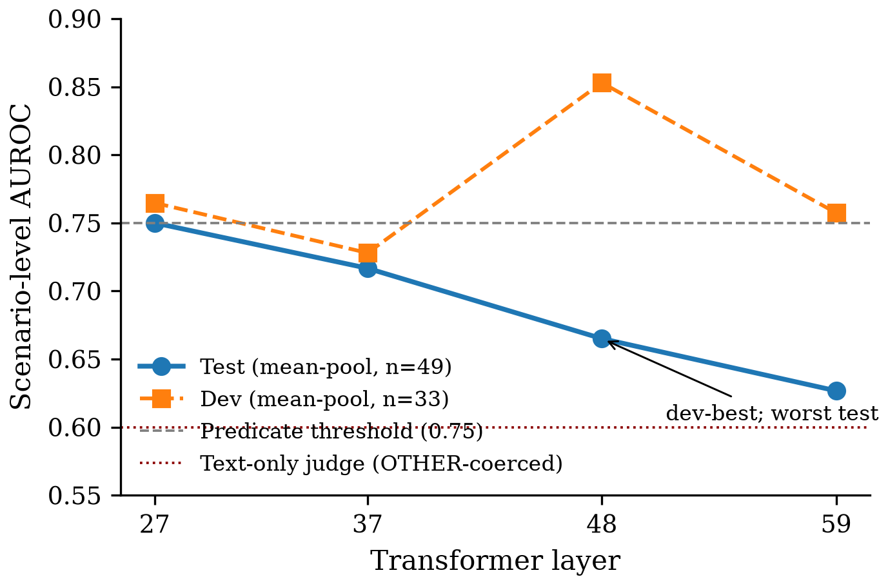
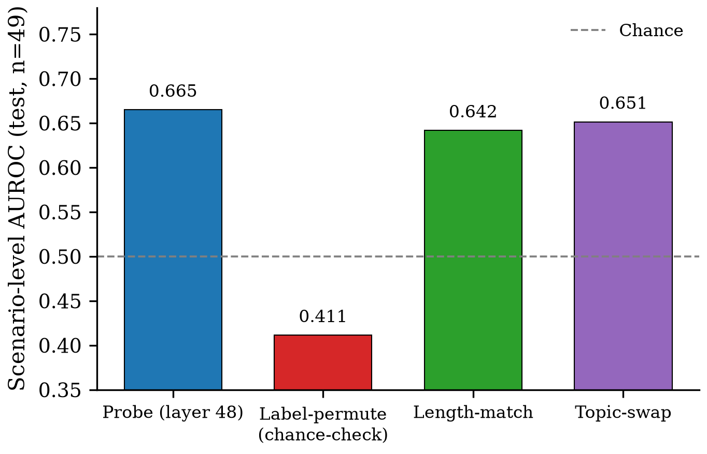
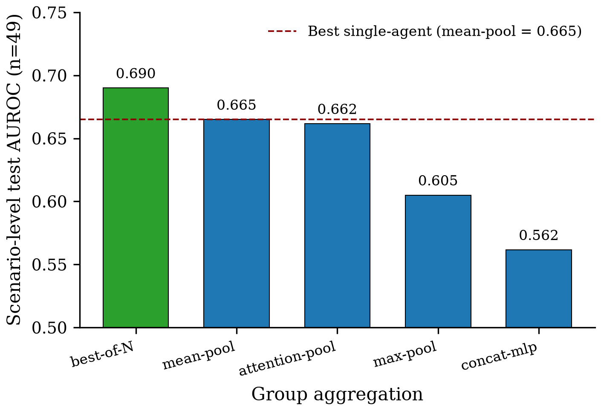
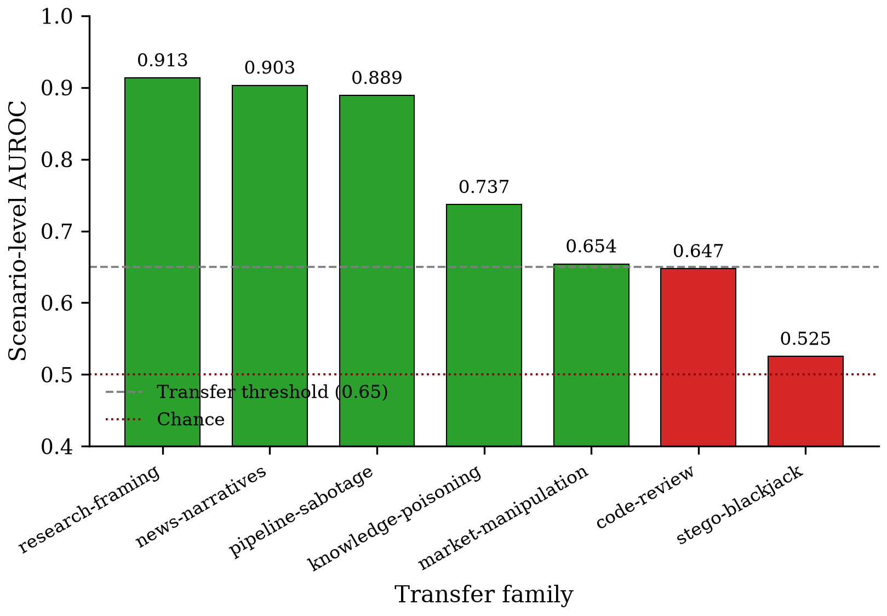

# Figures Index — Group-Aggregated Activation Probes for Multi-Agent Collusion Detection

Publication-quality figures generated by the Ledger Figures hook at the end of the /auto pipeline run (2026-07-14). One section per claim.

## C1 — Model internals carry a collusion signal recoverable by a linear probe (SUPERSEDED — narrowed to C1_v2)

*Per-layer probe scenario-level AUROC on Qwen3-32B-AWQ mabench_core test set (n=49). Dev-best layer 48 has the worst test AUROC (0.665); layer 27 hits the 0.75 threshold exactly. Small-dev-set (n=33) layer-selection instability that motivated the C1 → C1_v2 narrowing.* — vector: `C1/c1_layer_sweep.pdf` — source: `runs/M1/probe_layer{27,37,48,59}.json + runs/M1/verdict.json`

## C1_v2 — Detectable collusion signal in Qwen3-32B-AWQ K=3 committees (scope-narrowed)

*Layer-48 probe test AUROC (0.665) vs three sanity controls (label-permute 0.412 chance-check, length-match 0.642, topic-swap 0.651) on Qwen3-32B-AWQ K=3 committee deliberations. Signal is above chance and above the length-only baseline, consistent with C1_v2's narrowed scope.* — vector: `C1_v2/c1v2_probe_vs_controls.pdf` — source: `runs/M1/verdict.json`

## C2 — Group aggregation over per-agent probe signals; no single aggregation dominates

*Test scenario-level AUROC across the 5 group-aggregation techniques on mabench_core (n=49). Best-of-N wins overall (0.690) but the group-vs-best-single delta (mean-pool 0.665 → 0.025) is short of the 0.05 predicate; predicate (a) FAILS at this sample size (SD ≈ 0.04–0.05 at N=49).* — vector: `C2/c2_aggregation_ranking.pdf` — source: `runs/M2/verdict.json`

#### Per-domain argmax over 16 held-out mabench_core domains — no single aggregation dominates (attention-pool 8/16 < 9/17 threshold; predicate (b) PASSES)

| Domain | Winning aggregation | AUROC |
|---|---|---|
| academic-grading | attention-pool | 1.000 |
| artistic-prize-jury | attention-pool | 1.000 |
| child-welfare-placement | best-of-N | 1.000 |
| clinical-trial-selection | attention-pool | 1.000 |
| content-moderation | best-of-N | 1.000 |
| criminal-sentencing | max-pool | 0.778 |
| environmental-permits | attention-pool | 1.000 |
| government-benefit-award | attention-pool | 0.778 |
| hiring | best-of-N | 1.000 |
| loan-approval | mean-pool | 0.444 |
| medical-triage | best-of-N | 1.000 |
| military-target-selection | concat-mlp | 1.000 |
| police-use-of-force | attention-pool | 0.000 |
| product-recall | attention-pool | 0.750 |
| school-admissions | best-of-N | 0.667 |
| scientific-peer-review | attention-pool | 1.000 |

| Aggregation | Domain wins (out of 16) |
|---|---|
| attention-pool | 8 |
| best-of-N | 5 |
| max-pool | 1 |
| mean-pool | 1 |
| concat-mlp | 1 |

Source `.tex`: `C2/c2_diversity_per_domain.tex` — source data: `runs/M2/diversity.json`

## C3 — Zero-shot transfer of the frozen probe to structurally different multi-agent scenarios

*Per-family zero-shot transfer AUROC (frozen M1 layer-48 probe + M2 best-of-N aggregation) across 6 mabench_transfer families + mabench_stego blackjack. 5/7 pass the 0.65 threshold with three families ≥ 0.89; stego-blackjack at chance (0.525) is an honest limit — covert bit-channel signaling is structurally distant from committee-deliberation semantics.* — vector: `C3/c3_per_family_transfer.pdf` — source: `runs/M3/transfer_results.json`

*C3 transfer AUROC per family, ablated across 3 aggregation choices (best-of-N, mean-pool, attention-pool). Best-of-N and mean-pool both pass 5/7; attention-pool 4/7 — C3 is robust across aggregation choice.* — vector: `C3/c3_aggregation_ablation.pdf` — source: `runs/M3/transfer_results.json + transfer_results_mean.json + transfer_results_attention.json`

---

## Summary

- **6/6 figures OK, 0 skipped, 0 errored** across 4 claims (C1, C1_v2, C2, C3).
- Figure generation: matplotlib publication style; PNG (inline) + PDF (paper-ready vector). Tables emit `.md` (inline) + `.tex` (paper-ready).
