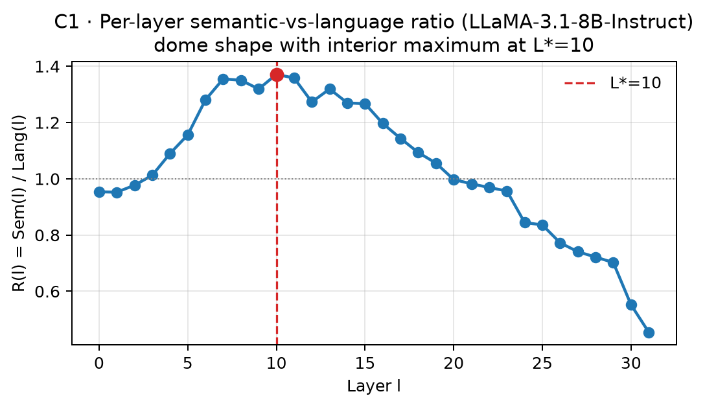
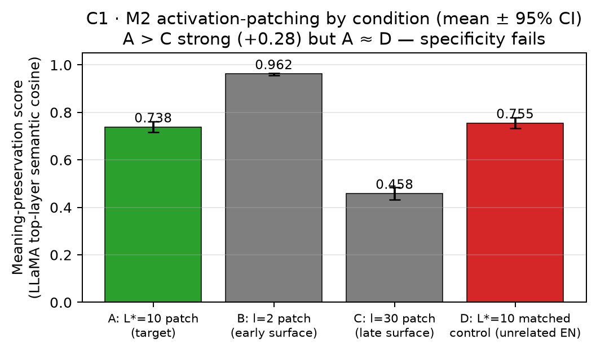
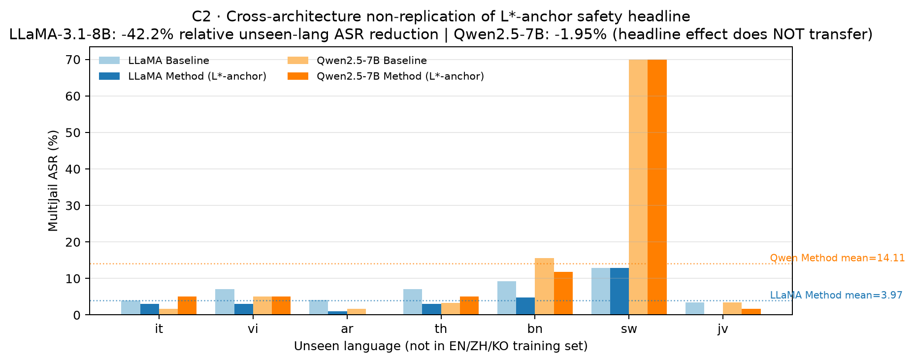

# Figures Index — /auto run 2026-07-14

## C1 — semantic-bottleneck layer L*

Per-layer semantic-vs-language ratio R(l) on LLaMA-3.1-8B-Instruct: dome shape with interior maximum at L*=10 (R_max=1.371), refuting the monotonic-R falsifier. Vector: [c1_bottleneck_dome.pdf](C1/c1_bottleneck_dome.pdf).

M2 activation-patching by condition (mean ± 95% CI): A(patch@L*=10)=0.738, B(patch@l=2)=0.962, C(patch@l=30)=0.458, D(matched-control@L*=10)=0.755. A > C strong (+0.28) but A ≈ D — matched-control specificity fails at last-token position. Vector: [c1_m2_specificity.pdf](C1/c1_m2_specificity.pdf).

## C2 — L*-anchored DPO cross-architecture

Cross-architecture non-replication of the L*-anchor safety headline. LLaMA-3.1-8B Method achieves -42.2% relative unseen-language MultiJail ASR reduction (mean 6.86% → 3.97%); the same recipe on Qwen2.5-7B yields only -1.95% (14.39% → 14.11%). The LLaMA safety benefit does not carry over to Qwen2.5-7B under identical hyperparameters. Vector: [c2_cross_arch_asr.pdf](C2/c2_cross_arch_asr.pdf).
