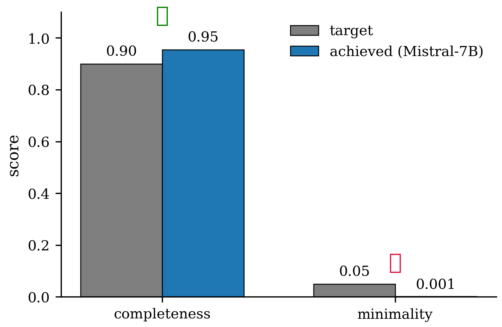
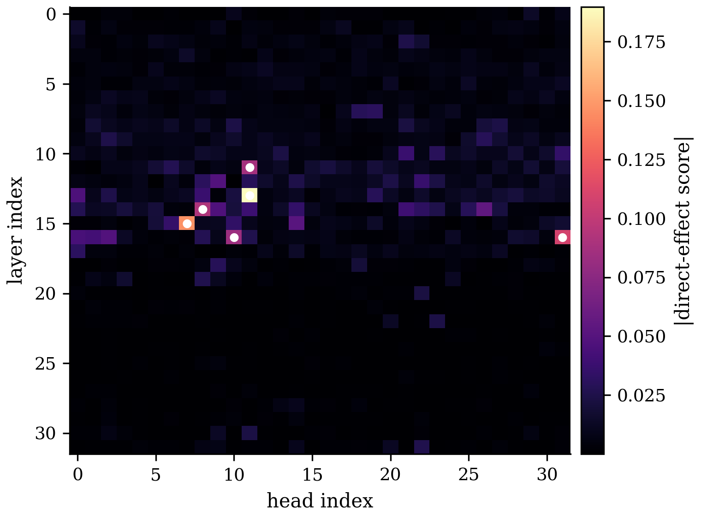
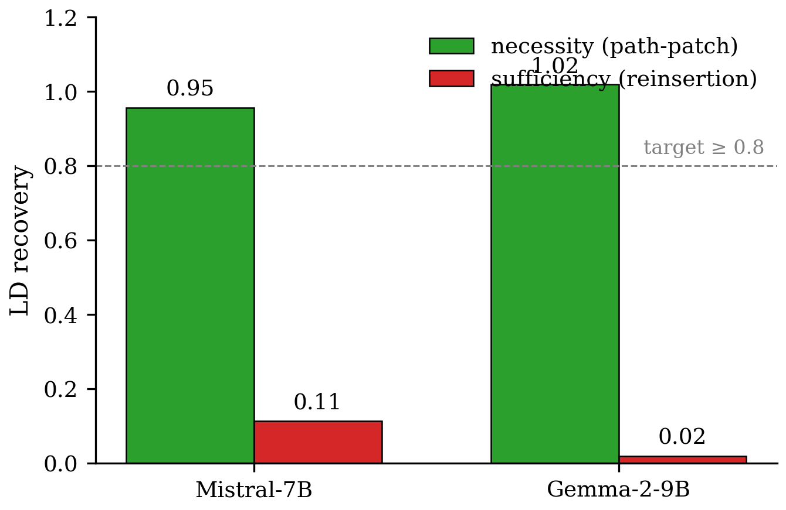

# Figures Index — Sparse Modular Circuit for Propositional-Logic Reasoning

Generated by /auto's Ledger Figures hook on 2026-07-15.

## C1 — sparse component set (Mistral-7B propositional logic)

### C1 Figure 1 — completeness vs minimality

*Vector PDF: `C1/c1_completeness_minimality.pdf`. Source: `results/M1_attribution.json`.*

### C1 Figure 2 — attribution heatmap

*Vector PDF: `C1/c1_attribution_heatmap.pdf`. Source: `results/M1_attribution.json`.*

---

## C2 — modular decomposition (fact-id / rule-app / answer-proj)

### C2 Table 1 — role-dissociation + cross-cell Jaccard stability

| role | dissociation (target ≥ 0.1) | null-shuffle p (target ≤ 0.01) | Jaccard k5c2↔k3c3 (target ≥ 0.6) | signal |
|---|---|---|---|---|
| fact | 0.089 | 0.05 | 0.75 | borderline ✓ |
| rule | 0.027 | 1.00 | 0.36 | random-like ✗ |
| answer | 0.026 | 1.00 | 0.77 | random-like ✗ |

Median per-component dominance ratio on the anchor cell: **1.20** (target ≥ 2.0) — refuted.

*Source `.tex`: `C2/c2_role_dissociation_table.tex`.*

---

## C3 — necessity + sufficiency (path patching / reinsertion)

### C3 Figure 1 — necessity vs sufficiency (cross-family)

*Vector PDF: `C3/c3_necessity_vs_sufficiency.pdf`. Source: `results/M2_necessity.json + results/M3_sufficiency.json + results/M5_gemma9b.json`.*

### C3 Table 1 — full recovery-metric comparison

| model | LD nec (≥0.8) | PD nec | specificity nec (≥0.6) | LD suf (≥0.8) | PD suf | KL suf | specificity suf |
|---|---|---|---|---|---|---|---|
| Mistral-7B-v0.1 | 0.955 | 0.905 | 0.836 | 0.113 | 0.116 | 0.076 | 0.113 |
| Gemma-2-9B | 1.018 | 1.012 | — | 0.019 | 0.005 | -0.050 | — |

KL recovery on the anchor cell is de-emphasised because the baseline KL(clean‖corrupt) is 0.043, so the recovery ratio blows up; LD and PD are the definitive metrics and tell the same story.

*Source `.tex`: `C3/c3_metric_comparison_table.tex`.*

---

**Total**: 5 figures generated (2 image + 1 table for C1+C2 combined; 1 image + 1 table for C3). 0 skipped. 0 errored.
