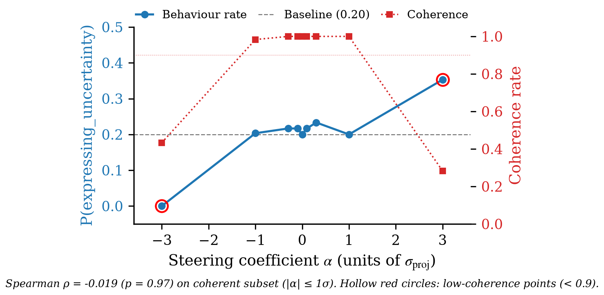

# Figures Index

Generated: 2026-07-15 by `mechanist:paper-figure` (auto-ledger mode) via
`/auto`'s Ledger Figures hook.

Per-claim figure trees live under `figures/<claim_id>/`. Each tree carries
its own `INDEX.json` (machine-readable summary), the per-figure generator
scripts, and the rendered artifacts (`.pdf` + `.png` for image figures,
`.md` + `.tex` for tables).

## Per-claim summary

| Claim | Title | Figures | Status |
|---|---|---|---|
| [C1](C1/INDEX.json) | Linear behaviour directions in the residual stream | 1 | ok |
| [C2](C2/INDEX.json) | Small-pool extractability | 0 | no plan |
| [C3](C3/INDEX.json) | Dose-response causal control (ORIGINAL, superseded) | 0 | no plan |
| [C3_v2](C3_v2/INDEX.json) | Learned direction is NOT causally specific (random-direction control) | 2 | ok |
| [C4](C4/INDEX.json) | Finer than prompt (ORIGINAL, superseded) | 0 | no plan |
| [C4_v2](C4_v2/INDEX.json) | Scale-invariant coefficient — coherence preserved, granularity lost | 1 | ok |

## C1 — Linear behaviour directions in the residual stream

![Per-behaviour held-out linear-probe ROC-AUC vs layer for DeepSeek-R1-Distill-Llama-8B. Four behaviours reach AUC >= 0.75 at a chosen layer L*(b) (uncertainty=0.977 at L29, validation=0.840 at L6, backtracking=1.000 at L1, self-correction=0.892 at L19), but first-PC alignment fails (|cos| in [0.26, 0.45]) - signal is decodable yet spread across many components.](C1/c1_layer_auc_per_behaviour.png)

## C3_v2 — Learned direction is NOT causally specific

## C4_v2 — Scale-invariant coefficient (table)

See [`C4_v2/c4v2_scale_invariance_table.md`](C4_v2/c4v2_scale_invariance_table.md) for the inline-renderable table and [`C4_v2/c4v2_scale_invariance_table.tex`](C4_v2/c4v2_scale_invariance_table.tex) for the publication-grade LaTeX.
