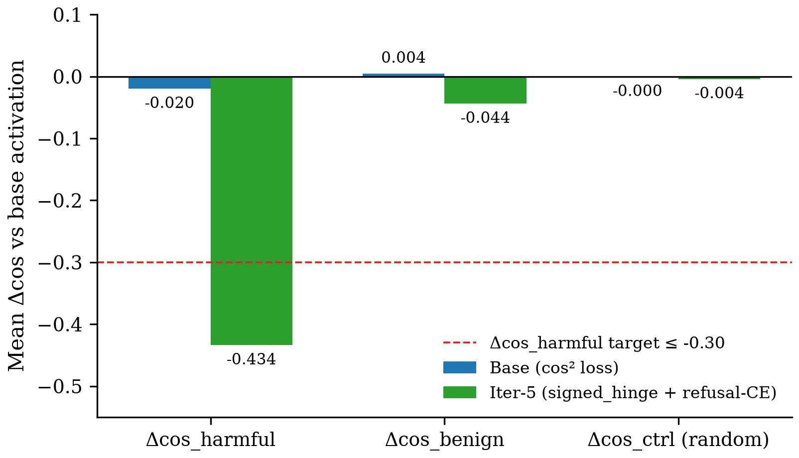
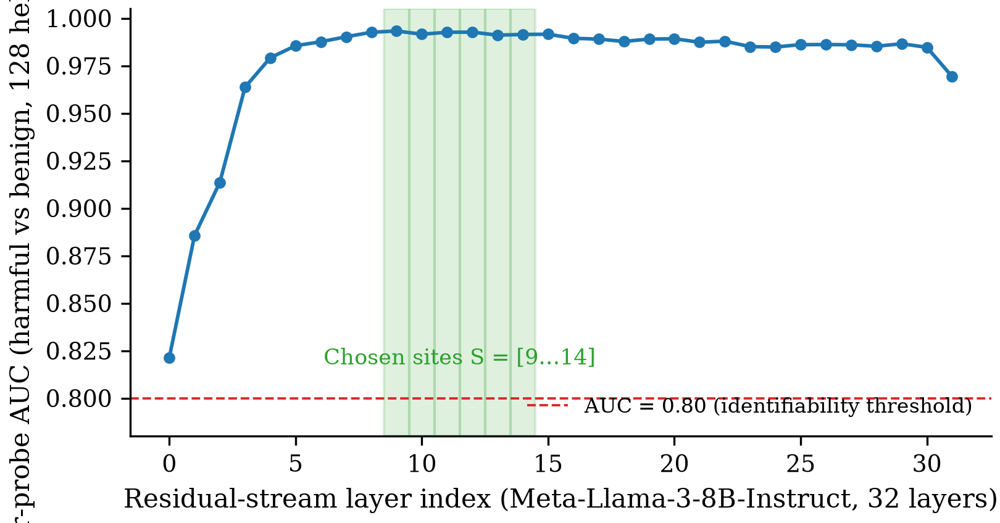
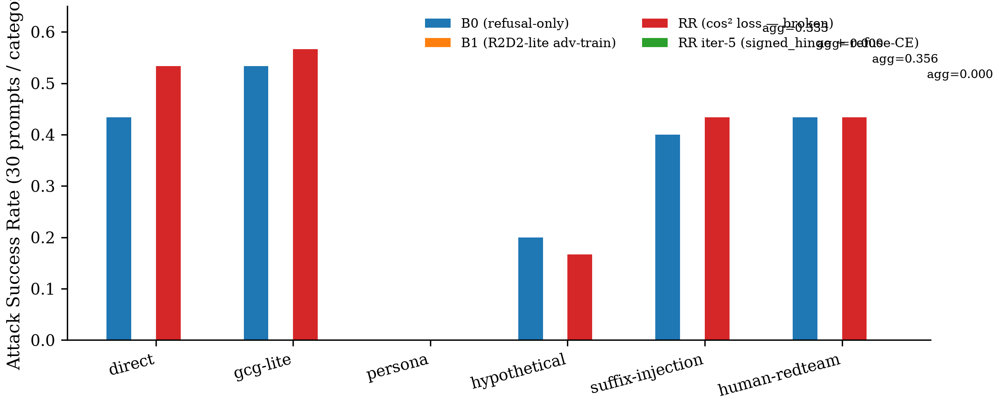
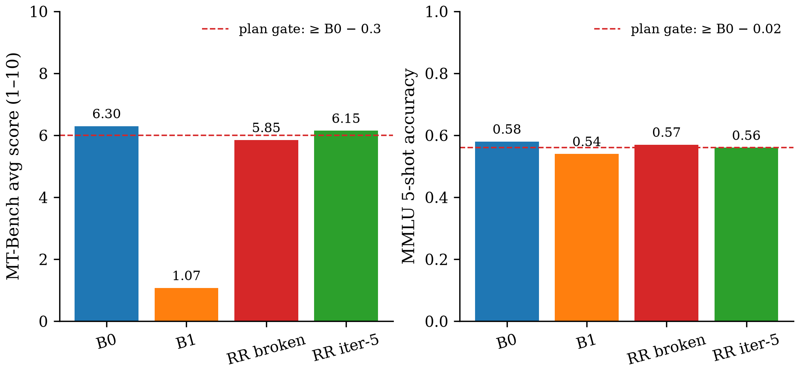
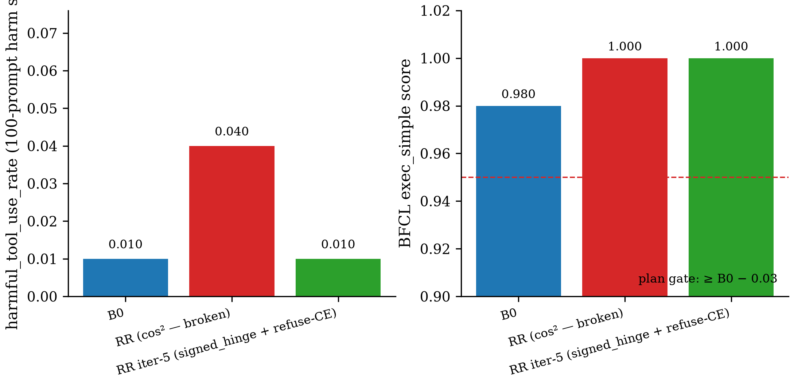

# Figures index — /auto ledger figures hook

Generated at final ledger hook (iteration:final) on 2026-07-15.
Per-claim manifests: `figures/<claim_id>/INDEX.json`.

## C1 — Identifiability + reroute

Vector: `C1/c1_reroute_before_after.pdf`

Vector: `C1/c1_auc_per_layer.pdf`

## C2 — HarmBench ASR + capability preservation

Vector: `C2/c2_harmbench_by_variant.pdf`

Vector: `C2/c2_capability_preservation.pdf`

## C3 — VLM transfer

_Judgment-skip: no plot data yet (M6 not re-fit with iter-5 recipe — see Ledger Open Items)._

## C4 — Agent transfer

Vector: `C4/c4_agent_harm_and_bfcl.pdf`
