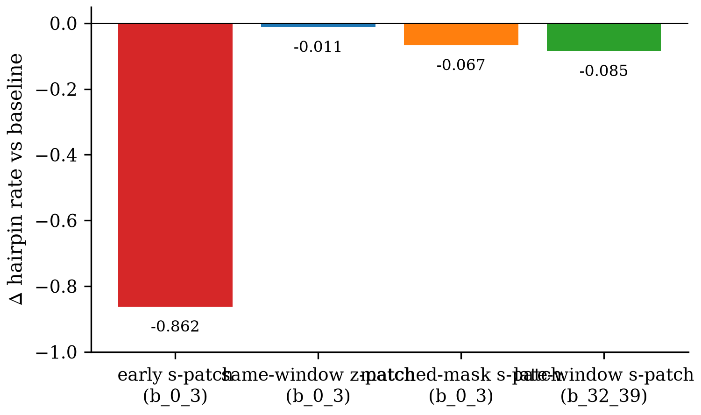
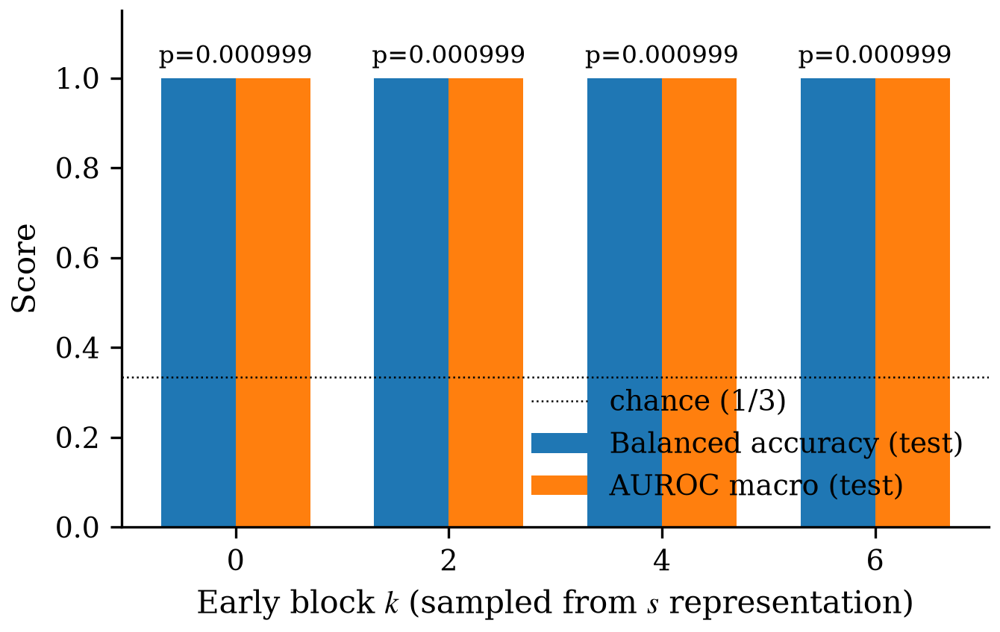

# Figures Index — ESMFold 折叠躯干 β-hairpin 机制的三-claim 因果验证

Generated at the final ledger hook of `/auto` (2026-07-15).

Per-claim figure sets: 3 claims / 5 figures / 4 image + 1 table / 0 render-error / 0 skipped.

## C1 — Early-block localization + `s` is the active locus

### c1_effect_by_band — Δ hairpin-rate by s-patching band vs baseline

Vector: [`C1/c1_effect_by_band.pdf`](C1/c1_effect_by_band.pdf) · Script: [`C1/gen_c1_effect_by_band.py`](C1/gen_c1_effect_by_band.py)

### c1_specificity_controls — C1 specificity

Vector: [`C1/c1_specificity_controls.pdf`](C1/c1_specificity_controls.pdf) · Script: [`C1/gen_c1_specificity_controls.py`](C1/gen_c1_specificity_controls.py)

---

## C2 — seq2pair as critical s→z channel (evidence-incomplete)

### c2_conditions_status — M2 evidence completeness

| Condition | N (records written) | Δ hairpin rate | Wilcoxon p | Status |
|-----------|--------------------:|---------------:|-----------:|--------|
| `seq2pair_donor` | 176 | -0.017 | 0.083 | complete |
| `pair2seq_donor` | 3 | — | — | hook shape bug |
| `seq2pair_zero` | 3 | — | — | hook shape bug |
| `seq2pair_matched_ctrl` | 3 | — | — | hook shape bug |

_Note: `pair2seq_donor`, `seq2pair_zero`, and `seq2pair_matched_ctrl` failed to write full records due to a `pair_to_sequence` hook shape-mismatch bug in `scripts/m2_worker.py` (expected `[B, L, S]`, actual `[B, num_heads, L, L, 32]`). The three specificity-control cells above are therefore evidence-incomplete, not scientifically null. Fix + re-run recommended in iteration._

LaTeX: [`C2/c2_conditions_status.tex`](C2/c2_conditions_status.tex) · Script: [`C2/gen_c2_conditions_status.py`](C2/gen_c2_conditions_status.py)

---

## C3 — Charge linear encoding + causal steering (partial)

### c3a_probe_by_block — M3a linear charge probe by block

Vector: [`C3/c3a_probe_by_block.pdf`](C3/c3a_probe_by_block.pdf) · Script: [`C3/gen_c3a_probe_by_block.py`](C3/gen_c3a_probe_by_block.py)

### c3b_dose_response — additive v_charge steering: decodable ≠ causally sufficient

Vector: [`C3/c3b_dose_response.pdf`](C3/c3b_dose_response.pdf) · Script: [`C3/gen_c3b_dose_response.py`](C3/gen_c3b_dose_response.py)
