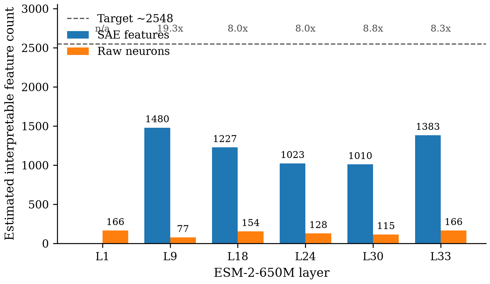
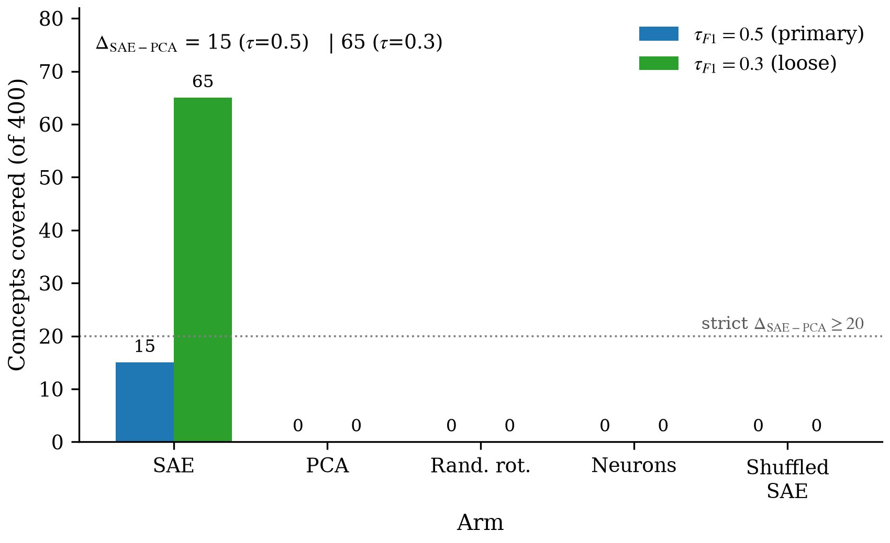

# Figures Index — Ledger Figures Hook

Generated by the `/mechanist:paper-figure` skill in `auto-ledger` mode as part of `/auto`'s terminal ledger writeback. Per-claim outputs live under `figures/<claim_id>/` and each carry a machine-readable `INDEX.json` consumed by the orchestrator.

Six claims total. Summary:

| Claim | Type | Status |
|---|---|---|
| c1 — SAE >=10x raw-neuron interpretable count per layer | bar figure | ok |
| c2 — SAE concept coverage >> raw neurons on Swiss-Prot | table | ok |
| c3 — SAE > PCA ~= random-rotation ~= neurons > shuffled-SAE ladder | grouped-bar figure | ok |
| c4 — >=10% of unaligned SAE features have novel LLM auto-interp labels | (none) | skipped — prose-only null story |
| c5a — SAE-probe > neuron-probe on Swiss-Prot annotation-filling | table | ok |
| c5b — SAE-feature-clamp steers ESM-2 generation with monotone dose-response | table | ok |

Formats: image figures = `.pdf` (vector, for later paper use) + `.png` (raster, for Markdown embed). Table figures = `.md` (inline-embeddable) + `.tex` (publication-grade).

---

## c1 — SAE >=10x raw-neuron interpretable count per layer (target ~2548)

**Figure `c1_per_layer_bar`** — Per-layer estimated interpretable SAE features vs raw-neuron features (ESM-2-650M). Ratio SAE/neuron >=10x is MET at every non-L1 layer (8.0–19.3x); absolute target ~2548 (dashed line) is not hit at any layer — best is L9 at 1480 (main experiment) / 1430 (iter-2 rerun @ 3000 seqs x 300 features, 95% CI [1034, 1825]).

Vector: [`c1/c1_per_layer_bar.pdf`](c1/c1_per_layer_bar.pdf). Source data: `refine-logs/EXPERIMENT_RESULTS.md#M1`.

---

## c2 — SAE concept coverage >> raw neurons on Swiss-Prot

**Table `c2_sensitivity_table`** — Sensitivity sweep of Swiss-Prot concept coverage (SAE vs raw neurons) across (q_top, tau_F1) grid, for the main ESM-2-650M experiment and the ESM-2-8M model-swap verify variant. SAE>>neurons gap is preserved across the 80x parameter-count reduction: SAE covered=15 (650M) vs 14 (8M) at primary (q=0.99, tau=0.5); neurons=0 in both.

| $q_{\text{top}}$ | $\tau_{F1}$ | SAE (650M) | Neu (650M) | Ratio (650M) | SAE (8M) | Neu (8M) | Ratio (8M) |
|---|---|---|---|---|---|---|---|
| 0.95 | 0.3 | 64 | 2 | 32.0× | 56 | 2 | 28.0× |
| 0.95 | 0.5 | 16 | 1 | 16.0× | 13 | 2 | 6.5× |
| 0.95 | 0.7 | 3 | 0 | ∞ | 2 | 0 | ∞ |
| 0.99 | 0.3 | 65 | 0 | ∞ | 58 | 3 | 19.3× |
| 0.99 * | 0.5 | 15 | 0 | ∞ | 14 | 0 | ∞ |
| 0.99 | 0.7 | 3 | 0 | ∞ | 2 | 0 | ∞ |

`*` primary setting used for the main verdict.

LaTeX: [`c2/c2_sensitivity_table.tex`](c2/c2_sensitivity_table.tex). Source data: `verify/c2_sae_concept_alignment_gap/ROBUSTNESS.md`.

---

## c3 — SAE > PCA ~= random-rotation ~= neurons > shuffled-SAE ladder

**Figure `c3_ladder_bar`** — Six-arm specificity ladder (Swiss-Prot concept coverage under identical F1 protocol) at the primary setting (q_top=0.99, tau_F1=0.5) and at the looser setting (tau_F1=0.3). SAE strictly beats every control (PCA, random-orthogonal-rotation, raw neurons, shuffled-SAE); strict target Delta_SAE-PCA >= 20 is a near-miss at primary (Delta=15) but clearly met at tau=0.3 (Delta=65).

Vector: [`c3/c3_ladder_bar.pdf`](c3/c3_ladder_bar.pdf). Source data: `refine-logs/EXPERIMENT_RESULTS.md#M3`.

---

## c4 — >=10% of unaligned SAE features have novel LLM auto-interp labels

**Skipped** — no figure planned. `plan_inline` empty by orchestrator judgment: 0/100 novel on both SAE and matched-control arms; the auto-interp criterion cannot discriminate, and the null story is fully carried by the ledger prose. Adding a bar/histogram would only re-render two zeros.

---

## c5a — SAE-probe > neuron-probe on Swiss-Prot annotation-filling

**Table `c5a_before_after_table`** — Per-arm PR-AUC on annotation-filling before (baseline: SGDClassifier max_iter=30, no class_weight, dead-code path) and after (iter-1 fix: well-converged log-loss SGD, class_weight='balanced', tol-early-stop) the probe-code fix. The fair-test null holds: mean PR-AUC(SAE)=0.539 <= mean PR-AUC(neurons)=0.548, paired-Wilcoxon p=0.516. Credible negative — the SAE code does not carry more annotation-decodable info than the raw residual at layer 9.

| Stage | n_concepts | mean PR-AUC (SAE) | mean PR-AUC (neurons) | Paired-Wilcoxon W | one-sided p (SAE > Neu) |
|---|---|---|---|---|---|
| Before fix (baseline) | 30 | 0.5907 | 0.5906 | 276.0 | 0.191 |
| After fix (iter-1) | 30 | 0.5391 | 0.5476 | 231.0 | 0.516 |

**Interpretation.** The fair-test null holds both before and after the probe-code fix (well-converged log-loss SGD, `class_weight='balanced'`, tol-early-stop). Post-fix, mean PR-AUC(SAE) = 0.5391 is actually below mean PR-AUC(neurons) = 0.5476, with paired-Wilcoxon p = 0.516. Credible negative: the SAE code at layer 9 does not carry more annotation-decodable information than the raw residual.

LaTeX: [`c5a/c5a_before_after_table.tex`](c5a/c5a_before_after_table.tex). Source data: `runs/iteration_round_1/m5_c5a_logreg_fix/wilcoxon.json`.

---

## c5b — SAE-feature-clamp steers ESM-2 generation with monotone dose-response

**Table `c5b_yield_matrix_table`** — Yield per (target-property feature x steering arm x dose alpha in {0.5,1,2,4}·sigma_f) across 3 features (TM helix 3998, Zn finger 4209, SP core 1240). No-steer baseline yields dominate every steered arm on every feature; plausibility band-pass >= 0.67 on all steered arms shows no off-distribution collapse. Interpretation: steering is ineffective (not destructive) under this narrow <=1-OOM dose ladder + rule-based checkers.

| Feature | Property | no_steer (baseline) | sae_clamp (α∈{0.5,1,2,4}·σ_f) | mean_add | random_clamp |
|---|---|---|---|---|---|
| 3998 | TM helix | **0.333** | 0.200 (all α) | 0.133–0.200 | 0.200 (all α) |
| 4209 | Zn finger | **0.133** | 0.100 (all α) | 0.100 (all α) | 0.100 (all α) |
| 1240 | SP core | **0.167** | 0.133 (all α) | 0.133 (all α) | 0.133 (all α) |

Notes: yield = fraction of the 30 generated sequences (10 seqs × 3 seeds) that satisfy the target property's rule-based checker (Kyte–Doolittle window for TM, ProSite regex for Zn, SignalP-like N-terminal core rule for SP). Baseline yields dominate every steered arm on every feature. Plausibility band-pass ≥ 0.67 on all steered arms, so drops are not off-distribution collapse — the steering is ineffective, not destructive, under this narrow ≤1-OOM dose ladder.

LaTeX: [`c5b/c5b_yield_matrix_table.tex`](c5b/c5b_yield_matrix_table.tex). Source data: `refine-logs/EXPERIMENT_RESULTS.md#M6`.
